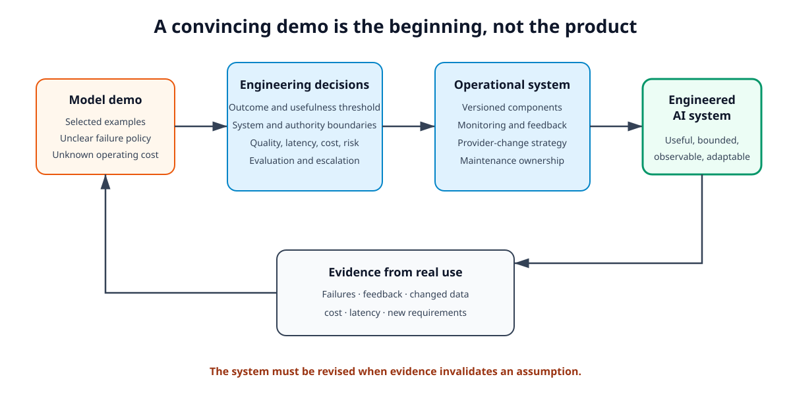
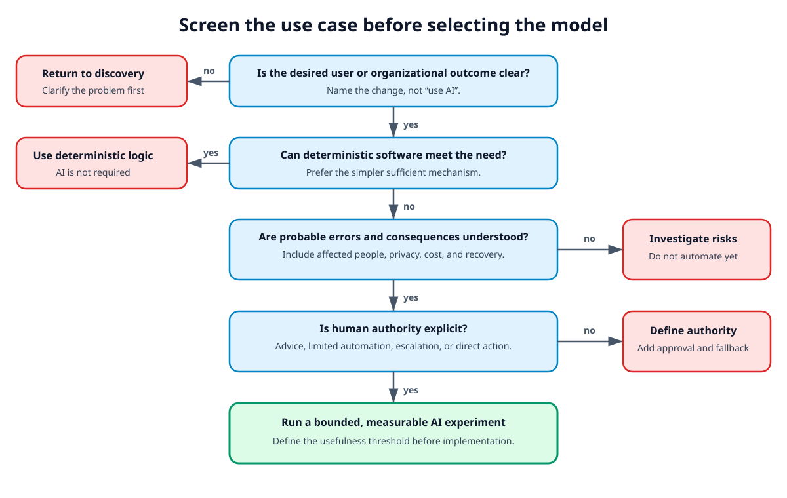
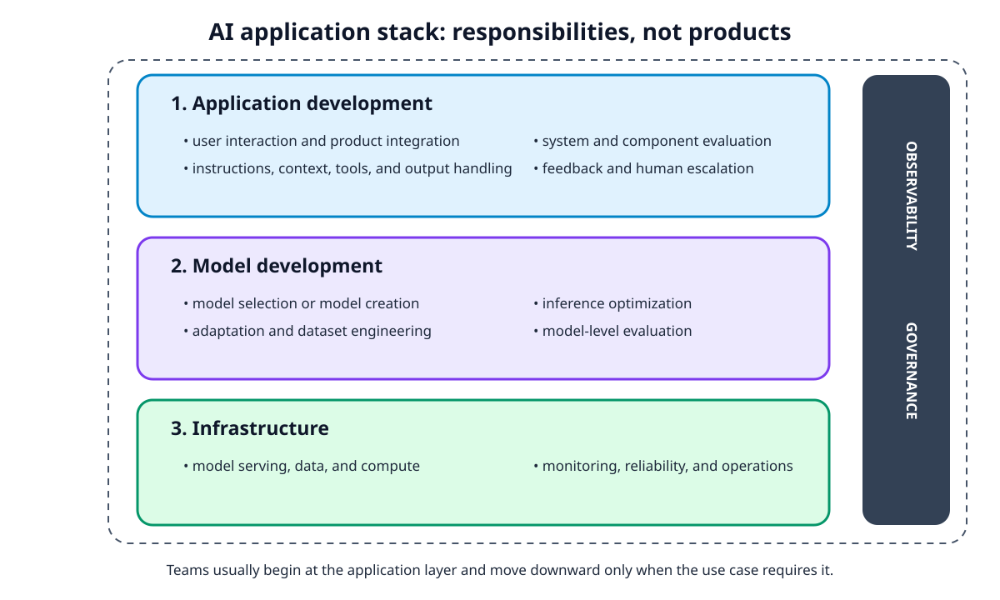
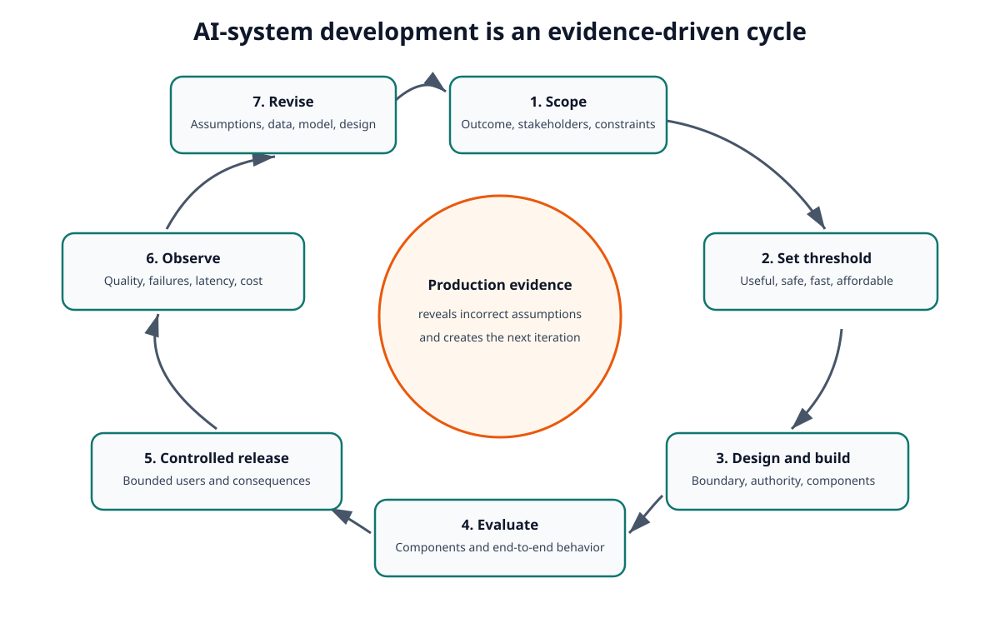
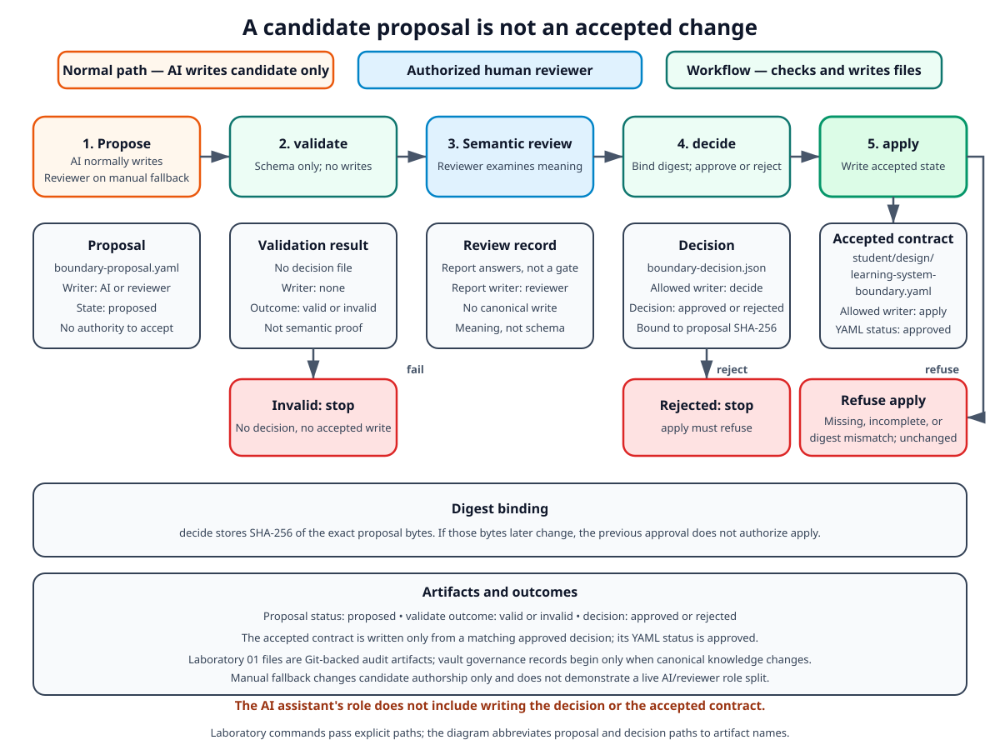

# Module 01: AI Engineering Foundations — Theory

> **Status:** Ready for Students — English theory approved as part of the Module 01 English pair on 2026-09-06

> **Source-page note:** Page numbers in `Further reading` blocks refer to the current working PDF editions. They are edition-specific and must be rechecked if the course changes to another print, EPUB, PDF, or online edition.

## Engineering problem: the demonstration works, but is it a system?

A development team connects a general-purpose AI model to a chat interface. During a demonstration, the application answers several prepared questions well. The team concludes that the product is almost finished.

Ordinary use may expose system-level failures and unanswered operational questions that a prepared demonstration did not reveal. The following situations are illustrative examples, not a sequence of events or an exhaustive checklist:

- a user asks a question for which the system has insufficient information;
- the model produces a plausible but unsupported answer;
- a request containing sensitive information is sent to an external service;
- response time and operating cost increase with longer conversations;
- a provider changes the behavior of the model;
- nobody can state which failures require human intervention;
- the team has no agreed measure of whether the application is useful.

The model demonstration proved only that one model could produce promising outputs for selected inputs. It did not establish the value, boundary, quality, safety, maintainability, or operational behavior of the complete system.

**Figure 1.** A model demonstration becomes an engineered AI system only after the team defines outcomes, boundaries, evaluation criteria, operational responsibilities, and a feedback process. The return arrow is essential: evidence from real use can invalidate the original design assumptions.

This module develops the system-level reasoning needed before selecting frameworks or optimizing prompts. Its central claim is:

> AI engineering is not the act of calling a model. It is the disciplined design and operation of a system in which an AI model is one consequential component.

## Learning outcomes

After this session, students can:

- distinguish AI engineering from traditional machine-learning engineering and conventional software engineering;
- explain why a foundation-model application must be designed as a complete system;
- perform a short AI-specific screening of a proposed use case;
- identify responsibilities in the application-development, model-development, and infrastructure layers;
- define a usefulness threshold using outcome, quality, latency, cost, and risk considerations;
- explain why AI-system development is iterative and continues after deployment;
- distinguish a structurally valid AI proposal from a digest-bound student decision and from later application to accepted state.

## 1. Why foundation models changed application development

The module begins by identifying what changed in the engineering problem. Foundation models did not remove the need for software or machine-learning engineering; they changed the point from which many application projects can start and shifted attention toward integrating, constraining, evaluating, and operating reusable model capabilities.

### 1.1 From task-specific models to reusable models

Traditional machine-learning projects often begin with a task and then develop or train a model for that task. A spam classifier, demand forecaster, and image detector may use different datasets, architectures, and training processes.

A **foundation model** is a general-purpose model that can be adapted for many downstream applications. Instead of beginning every project by training a model from scratch, a team can begin with an existing model and focus on making it useful within a specific product and operating environment. This lowers the entry barrier to experimentation and shifts a significant part of the engineering effort toward application design, model adaptation, evaluation, and integration [1, Chapter 1, “From Large Language Models to Foundation Models” and “From Foundation Models to AI Engineering”].

This shift does not eliminate model development. Some applications still require fine-tuning, specialized models, or models developed internally. The engineering decision is not “foundation models always replace task-specific models.” It is “the availability of reusable models changes where a project can begin and which responsibilities become central.”

### 1.2 Minimal model behavior needed in this module

A **token** is a unit that a language model processes. Depending on the model, a token can correspond to a word, part of a word, punctuation, or another learned unit. An autoregressive language model estimates a probability distribution for the next token given preceding tokens and generates a sequence by repeatedly selecting a next token [1, Chapter 1, “Language models”].

Two engineering consequences follow:

1. The model assigns probabilities to possible next tokens; the decoding procedure may select from that distribution stochastically or deterministically, but the resulting text is not a guaranteed retrieved fact.
2. A fluent output can still be incorrect, unsupported, unsafe, or unsuitable for the current user and task.

This module uses these consequences to motivate system boundaries and evaluation. Tokenization, context windows, sampling methods, and structured output are developed in Module 02.

### 1.3 What AI engineering emphasizes

Chip Huyen defines AI engineering as the process of building applications on top of foundation models [1, Chapter 1, “From Foundation Models to AI Engineering”]. Compared with traditional machine-learning engineering, the work commonly shifts in three directions:

- from training every model toward selecting and adapting existing models;
- toward managing the cost and latency of large, compute-intensive models;
- toward evaluating open-ended outputs for which one exhaustive set of correct answers may not exist [1, Chapter 1, “AI Engineering Versus ML Engineering”].

The model is therefore not the whole product. The application must supply context, enforce boundaries, handle outputs, support users, collect feedback, and remain operable when models, data, requirements, or providers change.

> **Further reading:** [1], Chapter 1, “Language models,” working-copy PDF pp. 34–43; “From Large Language Models to Foundation Models,” pp. 44–50; “From Foundation Models to AI Engineering,” pp. 51–56; and “AI Engineering Versus ML Engineering,” pp. 97–111. See Figures 1-1 and 1-2 for tokenization and autoregressive generation.

## 2. AI engineering, ML engineering, and software engineering

The disciplines overlap. Treating them as mutually exclusive job titles obscures the more useful question: **which artifacts and failure modes must the team engineer?**

The following comparison is not a strict division of professions. It shows how each discipline changes the focus of engineering work, the artifacts that must be controlled, and the questions used to judge whether the resulting system is dependable.

| Discipline                            | Typical focus                                                         | Important artifacts                                                                            | Characteristic engineering concern                                                                                         |
| --------------------------------------- | ----------------------------------------------------------------------- | ------------------------------------------------------------------------------------------------ | ---------------------------------------------------------------------------------------------------------------------------- |
| Software engineering                  | Deterministic application behavior and integration                    | Code, interfaces, configuration, tests, deployed services                                      | Does the implemented logic satisfy the specification and operate reliably?                                                 |
| Machine-learning engineering          | Systems whose behavior is learned from data                           | Code, data, features, models, experiments, inference services                                  | Does the learned behavior generalize, remain reproducible, and survive changing data?                                      |
| AI engineering with foundation models | Applications that adapt and integrate reusable general-purpose models | Code, model and provider choices, prompts, context, tools, evaluation sets, policies, feedback | Does the complete application produce useful, bounded behavior despite open-ended model outputs and external dependencies? |

The comparison shows that AI engineering does not replace the other disciplines. It adds open-ended model behavior, new external dependencies, and additional artifacts that must be engineered together with the deterministic application and any learned components.

### 2.1 Continuity with software engineering

AI systems still need conventional software-engineering practices. The following groups are representative rather than an exhaustive process standard, and each controls a specific source of system risk:

- **Specification and architecture:** explicit requirements, interfaces, and separation of concerns define intended behavior and prevent the AI component from becoming an undefined center of the application.
- **Change control and verification:** version control and testing connect observed behavior to known versions of code, configuration, and other controlled artifacts.
- **Security and privacy:** access controls, data boundaries, and secure integration constrain which information and actions are available to the model and its surrounding application.
- **Operations and ownership:** deployment, monitoring, incident handling, maintenance, and named responsibility make failures detectable and changes governable after release.

An AI component does not excuse weak software design. It adds a behavior source that is harder to specify and test exhaustively.

#### 2.1.1 Match each artifact to its recovery mechanism

An engineered system should not rely on one preservation mechanism for every artifact. The course uses an instructional recovery classification that begins with the action required after loss. The following three recovery responsibilities are not additional layers of the AI engineering stack; they describe how different system artifacts remain recoverable:

- **Reproducible infrastructure:** installation, services, permissions, and host capabilities should be described through Infrastructure as Code so that the environment can be recreated by applying a controlled definition.
- **Version-controlled definitions:** application code, configuration, schemas, prompts, policies, and project instructions should be retained in Git so that changes can be reviewed and a known version can be restored.
- **Mutable canonical state:** user-created records and other irreplaceable state require backup because neither reapplying Infrastructure as Code nor cloning the project repository recreates their latest content.

The categories can overlap physically. Infrastructure-as-Code source is itself version-controlled, but the environment is recovered by applying it. The cumulative course project, introduced in Section 6.1, uses a Markdown vault: a directory of ordinary Markdown files whose user-created contents are mutable canonical state and therefore need an off-device recovery copy. Derived artifacts such as virtual environments, caches, embeddings, and vector or compiled graph indexes should instead be rebuildable from controlled definitions and canonical state.

Synchronization to an off-device service reduces the risk of losing a vault with one workstation, but it is only an initial protection measure because an unwanted change or deletion can also be synchronized. A complete disaster-recovery design additionally defines retention, monitoring, and a tested restoration procedure. Those production concerns are developed in Module 08.

### 2.2 Continuity with machine-learning engineering

Production machine-learning systems taught engineers to reason about more than model accuracy. Research experiments can optimize a benchmark score under controlled conditions, while production systems must satisfy multiple stakeholders and constraints. Their data changes, inference latency matters, fairness and interpretability may matter, and the system must be monitored and maintained [2, Chapter 1, “Machine Learning in Research Versus in Production”].

Machine-learning systems also differ from conventional software because behavior depends on code, data, and model artifacts. Testing and versioning only the application code is insufficient [2, Chapter 1, “Machine Learning Systems Versus Traditional Software”]. Foundation-model applications inherit these concerns and add changing model APIs, provider behavior, prompt and context artifacts, and open-ended outputs.

> **Further reading:** [2], Chapter 1, “Machine Learning in Research Versus in Production,” working-copy PDF pp. 30–40, and “Machine Learning Systems Versus Traditional Software,” pp. 40–44. See Figure 1-4 on latency and throughput and Figure 1-5 on research data versus production data.

### 2.3 A practical boundary

The following boundary is useful for this course:

- **Software engineering** supplies the dependable product structure.
- **Machine-learning engineering** supplies methods for data-dependent learned behavior in production.
- **AI engineering** applies and extends both to systems built around foundation-model capabilities.

This is an instructional synthesis, not a claim that every organization uses these titles in the same way.

Understanding these disciplinary boundaries does not yet justify building an AI component. Before allocating work among application, model, and infrastructure specialists, the team must establish whether AI is needed at all and what role it may safely perform. That decision is the subject of the next section.

## 3. Screen the use case before selecting the model

General requirements engineering establishes the desired outcome, stakeholders, constraints, and acceptance conditions for a system. AI use-case screening complements that work by addressing the additional questions created by uncertain learned behavior: whether AI is necessary, which errors are tolerable, where human authority is required, and what evidence would justify proceeding.

**AI use-case screening** is a preliminary decision process that determines whether using AI is appropriate for a proposed task before a model or detailed architecture is selected. It filters out proposals that can be solved more reliably by simpler means or whose expected value does not justify their cost and failure consequences. Screening is not a complete requirements analysis or a model evaluation; it establishes whether a bounded AI experiment deserves further design and what conditions that experiment must respect.

**Figure 2.** AI-specific screening begins with the desired outcome, not with a model. A project proceeds to a bounded experiment only when simpler alternatives, error consequences, human authority, and measurable usefulness have been considered.

### 3.1 Start with the outcome

“Add AI” is not an outcome. A useful statement names an observable change, for example:

- reduce the time a support specialist spends locating relevant policy information;
- increase the percentage of requests correctly routed to a responsible team;
- help a student identify missing evidence in a design explanation.

Model metrics matter only when they help explain movement toward the intended user or organizational outcome. *Designing Machine Learning Systems* warns that improving a model metric without connecting it to the business objective can consume resources without creating value [2, Chapter 2, “Business and ML Objectives”].

### 3.2 Ask whether AI is necessary

Machine learning is appropriate when useful behavior depends on patterns that are difficult to encode directly and when sufficient evidence exists to evaluate the learned behavior. It should not be the default when a lookup table, deterministic rule, search filter, or ordinary program satisfies the requirement more reliably and cheaply [2, Chapter 1, “When to Use Machine Learning”].

For foundation-model applications, the same principle applies: the team should compare the AI-based approach with simpler or more conventional alternatives, including:

- continuing with the current manual process;
- a deterministic software solution;
- an existing purchased product;
- a bounded AI component inside a larger deterministic workflow;
- a predominantly AI-driven interaction.

> **Further reading:** [2], Chapter 1, “When to Use Machine Learning,” working-copy PDF pp. 20–29, and Chapter 2, “Business and ML Objectives,” pp. 46–48. See Figure 1-2 for learned patterns versus hand-specified software patterns.

### 3.3 Define the role of AI and humans

If screening indicates that AI may add justified value, the next question is not yet which model to select, but which role the AI component may perform. That role determines the required quality, safeguards, and human authority [1, Chapter 1, “The role of AI and humans in the application”]. The course organizes the source distinctions into the following four design questions rather than categories to select in isolation. A team uses them to make the expected behavior and consequences of the AI component explicit:

- **Critical or complementary:** Does the application still provide its main value when the AI feature is unavailable?
- **Reactive or proactive:** Does the system respond to an explicit request, or does it interrupt and recommend action on its own initiative?
- **Advisory or autonomous:** Does AI propose options to a person, handle only low-risk cases, or act directly?
- **Static or dynamic:** Is behavior changed only through controlled releases, or can the application change its behavior continually from new evidence?

**Human-in-the-loop** means that a person participates in the decision or action process. Merely placing a confirmation button after an opaque recommendation is not automatically meaningful oversight. As a course engineering recommendation, meaningful oversight requires sufficient information, authority, and time to reject or correct the proposed action.

> **Further reading:** [1], Chapter 1, “The role of AI and humans in the application,” working-copy PDF pp. 80–84.

## 4. Define expectations before implementation

Use-case screening establishes whether an AI-based approach is plausible and where its authority should end. Before implementation begins, the team must translate that preliminary decision into explicit expectations for usefulness, production behavior, and acceptable trade-offs. Otherwise, there is no defensible basis for deciding whether an experiment or release has succeeded.

### 4.1 The usefulness threshold

A **usefulness threshold** is the minimum level of system performance and behavior at which deployment creates sufficient value for an explicitly bounded use case. It prevents a team from treating “the output looks impressive” as an acceptance criterion.

To construct a usefulness threshold, the team first selects the dimensions that represent value, acceptable behavior, and constraints for the use case. The following items are candidate dimensions, not complete thresholds by themselves:

- percentage of cases completed correctly;
- percentage of outputs accepted by a qualified human without correction;
- rate and severity of unsupported or unsafe outputs;
- end-to-end response time;
- cost per completed task;
- user satisfaction or task-completion improvement;
- privacy, fairness, or interpretability constraints;
- escalation rate and recovery behavior.

Each selected dimension must then be converted into a usable acceptance condition: a numerical boundary, a categorical requirement, or an explicit decision rule. For example, “response time” becomes a threshold only when the team defines which responses are measured and what latency is acceptable.

The threshold is a system property. It includes the interface, context, deterministic logic, model, tools, human process, and operational environment—not only the model response [1, Chapter 1, “Setting Expectations”].

> **Further reading:** [1], Chapter 1, “Setting Expectations” and “Milestone Planning,” working-copy PDF pp. 85–87.

### 4.2 Production requirements

Four durable characteristics from production machine-learning system design provide an initial checklist [2, Chapter 2, “Requirements for ML Systems”]. They do not replace the measurable acceptance conditions from Section 4.1. Instead, they help the team check whether the threshold and production requirements overlook important system properties:

**Reliability.** The system continues to perform the intended function at the required level under faults, incorrect inputs, unavailable dependencies, and human mistakes. AI failures can be silent: the service returns a well-formed response even when the content is wrong. Reliability therefore includes detection, containment, fallback, and recovery.

**Scalability.** The system can handle growth in traffic, data, users, models, tenants, and operational artifacts. Scaling is not only adding compute. It also includes automating evaluation, versioning, monitoring, and updates when manual handling is no longer practical.

**Maintainability.** Different contributors can understand, reproduce, diagnose, and change the system. Code, model identifiers, prompts, evaluation data, policies, and configuration need explicit ownership and versioning.

**Adaptability.** The system can respond to changed data, user behavior, requirements, models, providers, and regulation without uncontrolled service disruption.

> **Further reading:** [2], Chapter 2, “Requirements for ML Systems,” working-copy PDF pp. 49–52.

### 4.3 Trade-offs are design decisions

AI-system design rarely maximizes one property without affecting another. The following examples illustrate recurring trade-offs; they are not universal rules, and their importance depends on the use case:

- a more capable model may increase latency and cost;
- additional context may improve relevance but expose more sensitive data;
- a fully automated path may increase throughput but also increase the consequence of errors;
- a provider service may accelerate delivery but create operational and contractual dependency;
- a complex multi-component pipeline may improve selected cases while becoming harder to evaluate and maintain.

The correct design is not the design with the most AI. It is the simplest system that crosses the agreed usefulness threshold within its constraints.

## 5. Locate responsibilities in the AI engineering stack

Once expected system properties and trade-offs are explicit, the team must determine which components and people are responsible for achieving and verifying them. The rapidly changing tool landscape is easier to understand when products are separated from these durable responsibilities. *AI Engineering* groups the stack into application development, model development, and infrastructure [1, Chapter 1, “Three Layers of the AI Stack”]. The three layer boundaries come from that source; the responsibility lists below are a course synthesis that connects those layers to the system concerns developed earlier in this module.

**Figure 3.** The three layers organize engineering responsibilities. Evaluation crosses application and model work, while observability and governance apply across the complete system.

### 5.1 Application development

This layer turns model capability into a user-facing system. The following groups are representative responsibilities rather than an exhaustive layer contract:

- **Interaction and context construction:** interface design, instructions, supplied context, and tool access determine what the model is asked to do and what information and actions it can use.
- **Output control and evaluation:** deterministic validation, output handling, component tests, and end-to-end evaluation determine whether model behavior is acceptable within the complete workflow.
- **Workflow integration and feedback:** service integration, user feedback, and human escalation connect the AI component to real work while preserving recovery and oversight paths.

When many teams can access similar models, application design and accumulated product evidence often become major sources of differentiation [1, Chapter 1, “Application development”].

### 5.2 Model development

This layer supplies and adapts model behavior. Its representative responsibilities begin with model selection and extend to controlled changes in the model or its inference behavior:

- **Model sourcing:** selecting an existing model or developing one establishes the capability, dependency, license, and operating baseline.
- **Adaptation:** preparing data and applying fine-tuning or another weight-changing method modifies model behavior when application-level techniques are insufficient.
- **Inference optimization:** changing serving or inference choices balances output quality against latency, throughput, and cost.
- **Controlled model evaluation:** testing the model under defined conditions reveals capability limits before its behavior is judged inside the complete application.

A team should move deeper into this layer because evidence shows that application-level methods are insufficient—not because model training appears more sophisticated.

### 5.3 Infrastructure

Infrastructure makes the system operable. Its representative responsibilities provide the execution environment, protected connectivity, operational visibility, and continuity required by the application and model layers:

- **Serving and connectivity:** model serving or provider connectivity makes inference available under defined availability and latency expectations.
- **Data and compute management:** storage, processing capacity, and resource allocation support both application workloads and model operations.
- **Security boundaries:** secrets management, access control, and network boundaries protect data and restrict component authority.
- **Operational visibility:** telemetry, monitoring, and alerting reveal quality, latency, cost, dependency, and capacity problems.
- **Release and continuity:** deployment, rollback, capacity planning, and continuity mechanisms make changes recoverable and service operation sustainable.

The layers are not independent. A latency requirement can force a model change. A privacy boundary can restrict provider choices. Evaluation findings can require new application logic, data, or infrastructure telemetry. Because evidence in one layer can invalidate decisions in another, an initial allocation of responsibilities is not enough; the system must repeatedly evaluate and revise those decisions.

> **Further reading:** [1], Chapter 1, “The AI Engineering Stack” and “Three Layers of the AI Stack,” working-copy PDF pp. 91–113. See Figure 1-14, “Three layers of the AI engineering stack.”

## 6. Treat development as an iterative lifecycle

A linear story—collect data, build a model, deploy, finish—does not describe a production AI system. Production evidence exposes wrong assumptions, changed data, unmet stakeholder needs, and new failure modes. *Designing Machine Learning Systems* therefore presents development as an iterative process with repeated movement among scoping, data, development, deployment, monitoring, and revision [2, Chapter 2, “Iterative Process”].

**Figure 4.** Each release produces evidence. That evidence may change the threshold, boundary, model, data, interface, or even the original decision to use AI.

A simplified lifecycle for this course is:

1. **Scope:** define the outcome, stakeholders, constraints, and non-goals.
2. **Set the threshold:** state what useful and acceptable behavior means.
3. **Design and build:** allocate responsibilities among deterministic software, AI components, people, and infrastructure.
4. **Evaluate:** test components and end-to-end behavior against representative cases and risks.
5. **Release within a controlled boundary:** limit users, actions, data, or consequences while uncertainty remains high.
6. **Observe:** collect evidence about quality, failures, latency, cost, and user behavior.
7. **Revise:** update assumptions, requirements, data, model choice, context, interface, or authority boundaries.

The observe and revise stages make maintenance part of the lifecycle rather than an activity postponed until after success. Model and provider behavior, cost, regulation, and user needs can change throughout the system lifetime. New evidence may therefore send the team back to any earlier decision, including the original scope and the decision to use AI [1, Chapter 1, “Maintenance”].

> **Further reading:** [2], Chapter 2, “Iterative Process,” working-copy PDF pp. 52–55. See Figure 2-2, which presents ML-system development as a cycle with repeated movement between stages. See also [1], Chapter 1, “Maintenance,” working-copy PDF pp. 88–90, and Figure 1-11 for an example of model capability and inference cost changing over time.

### 6.1 Separate proposal, validation, decision, and application

The lifecycle in Section 6 describes how a team revises a system after evidence arrives. The course uses a narrower loop when an AI component proposes a change that would become accepted project or knowledge state. Generating a fluent candidate is not the same operation as changing canonical knowledge. This loop is one concrete implementation of **human-in-the-loop**, as defined in Section 3.3: it places an explicit change-control sequence before any accepted write rather than adding a confirmation button after the result has already been written. In this subsection, **accepted state** means a project artifact or canonical knowledge record that the system is authorized to treat as current. In Laboratory 01 it is a Git-backed boundary contract; later modules apply the same authority principle to canonical vault knowledge.

The cumulative project in this course is a workstation-local learning knowledge system. Local means that the student owns the knowledge state on the student's computer; it does not require a locally hosted model. The system's identity, obligations, and Laboratory 01 limits are supplied in the project brief and requirements baseline. They are not elicited or invented in this module, and they do not constitute a reference architecture.

Inside that project, an AI assistant may interpret evidence and write a candidate. The student then runs deterministic project commands: `validate` checks structure, `decide` records the student's approval or rejection, and `apply` writes accepted artifacts. Semantic authority remains with the student who owns the knowledge state. The AI assistant does not run `decide` or `apply`. This subsection isolates the authority-bearing segment from proposal through application rather than defining another general development lifecycle.

**Figure 5.** Each state-changing operation has a defined operator and authorized writer. The student runs `validate`, `decide`, and `apply`; `validate` writes no protocol artifact, while the student records the semantic review in the laboratory report. `validate` proves only that a candidate follows a machine-checkable contract. `decide` binds a human approval or rejection to the exact proposal bytes. `apply` is the authorized writer of the accepted artifact, and only when that bound decision still matches.

The five operations below are successive controls, not interchangeable names for one step. Operator and writer are different facts. The operator is who runs the step. The writer is which process the project contract authorizes to create or change a protocol artifact. Some operations intentionally have no protocol writer: `validate` returns a result without changing the proposal or decision, and semantic review is a human judgment recorded separately in the report. These assignments are governance rules rather than operating-system access controls. On the normal agent path, Laboratory 01 uses preserved evidence to show that the student and AI assistant respected them; the documented manual exception is described below. Laboratory 01 states the working directory: the student runs `validate`, `decide`, and `apply` from the `training-project` directory of the local clone. Those names are project commands in the workstation terminal, invoked as `uv run learning-project …`. An **agent harness** is the command-line or graphical interface used to interact with the AI assistant; the project commands are not slash commands entered in that interface. The laboratory instructions give the exact terminal commands.

A **candidate proposal** is an externalized change that has no authority to mutate accepted state. On the normal path, the AI assistant writes that candidate. In Laboratory 01 the file is `reports/lab01/boundary-proposal.yaml`, and its status remains `proposed`. The assistant must not record approval, invoke `decide` or `apply`, or write the accepted contract. The student may correct the candidate before review or author it under the documented no-agent exception below.

**Structural validation** is a deterministic check that the candidate follows the machine-checkable contract: required fields, allowed status, and other schema invariants. In Laboratory 01 the student runs the course command `validate`. Validation does not create a decision, does not write accepted state, and does not prove that the interpretation is correct, useful, or sufficiently supported. A structurally valid proposal can still be rejected.

**Semantic review** is the student's inspection of meaning against the supplied brief and the evidence named in the candidate. This review answers questions that a schema cannot: whether the outcome is still the learning knowledge system, whether non-goals and authority allocation are honest, and whether a later personal area is only a bounded extension. Laboratory 01 records that review in the report. A green validator is not the review.

**Decision** is the student's explicit approval or rejection of a named proposal. In Laboratory 01 the student runs the course command `decide`. The decision artifact is `reports/lab01/boundary-decision.json`, and that command writes it. The student must not hand-write the decision file, and the AI assistant must not invoke `decide`. The record binds the decision to the proposal identifier and to a Secure Hash Algorithm 256-bit (SHA-256) **content digest** of the exact bytes reviewed. A content digest is a fixed-length fingerprint of file content. If the bytes later change, recomputing SHA-256 will produce a mismatch with overwhelming probability, so the previous decision will not authorize application [3, “Explanation”]. The field `recorded_by` attributes the operator of the command. It is not authenticated proof of identity.

**Application** writes accepted state only from a matching approved decision. In Laboratory 01 the student runs the course command `apply` after recording approval. The accepted artifact is `student/design/learning-system-boundary.yaml`. Only that command writes it. The student must not create the file by hand, and the AI assistant must not write it or invoke `apply`. Application refuses and leaves accepted output unchanged when the decision is missing, incomplete, not `approved`, bound to a different proposal, or bound to a digest that no longer matches the proposal file. If the candidate changes after the decision, the previous approval does not authorize application.

The three Laboratory 01 protocol files therefore have different authorized writers. The table lists those files as one instance of the authority split, not as an architecture of the later knowledge system:

| Artifact | Who runs the step | Who writes the file | Meaning |
| --- | --- | --- | --- |
| `reports/lab01/boundary-proposal.yaml` | AI assistant on the normal path; student when correcting or using the manual fallback | AI assistant or student | Candidate content with no authority to accept |
| `reports/lab01/boundary-decision.json` | The student runs `decide` | `decide` | Bound record of approval or rejection |
| `student/design/learning-system-boundary.yaml` | The student runs `apply` | `apply` | Accepted contract generated only from a matching approved decision |

The protocol relates several artifacts and outcomes rather than moving one object through a single state sequence. The proposal remains `status: proposed`. `validate` returns a structurally valid or invalid outcome without writing a decision. `decide` writes a decision whose recorded outcome is `approved` or `rejected` and binds it to the proposal digest. `apply` writes the accepted artifact only from a matching approved decision; that artifact carries `status: approved`. An invalid proposal, rejected decision, missing decision, or digest mismatch produces no accepted write.

Laboratory 01 permits a documented manual fallback only when no existing agent path can complete the local proposal operation within available access and quota without a new purchase. In that exception, the student authors the candidate, records the attempted or unavailable path and any available sanitized failure evidence, and makes no AI-authorship claim. The instructor accepts that justification during the scheduled demonstration. The same validation, semantic-review, decision, and application gates remain. The fallback demonstrates artifact control but not live separation between AI and student actors, and it does not replace the normal authority allocation for later AI-generated changes.

Laboratory 01 uses this loop on Git-backed project audit files to verify the authority boundary. Those files are not vault knowledge records. Vault `proposals/`, `decisions/`, and `operations/` records begin when canonical vault knowledge starts to change. Laboratory 01 registers the Module 01 theory as a source; it does not create structured concept records.

The protocol is a course engineering control. It instantiates the human-authority requirement from Section 3.3 and the unbounded-automation failure mode in Section 7.6.1. It does not specify model serving, retrieval, storage internals, or the later reference architecture.

> **Further reading:** [1], Chapter 1, “The role of AI and humans in the application,” working-copy PDF pp. 80–84. The course implementation of the authority loop is specified in the supplied [functional brief](../../training-project/requirements/SYSTEM_BRIEF.md) and [requirements baseline](../../training-project/requirements/REQUIREMENTS_BASELINE.md), especially `GOV-001`–`GOV-013` and `L01-010`–`L01-014`. SHA-256 is defined by [3]. The project contracts instantiate the cited principle; they do not replace the literature or prescribe the later reference architecture.

## 7. Applying the framework: a bounded personal-information assistant

The previous sections introduced the main reasoning tools for AI-system design. Section 7 applies those tools to one small teaching case. The case is deliberately neutral: a personal-information assistant combines retrieval, open-ended generation, sensitive data, human approval, and operational constraints. It is not the cumulative course project, not a proposed production architecture, and not a laboratory design assignment. The course project remains the supplied learning knowledge system. The teaching case makes screening, threshold, allocation, and failure analysis visible.

Consider an assistant that helps a user find information in personal notes and prepare proposed updates. The system does not execute consequential changes without confirmation.

### 7.1 Outcome and non-goals

The analysis begins with the outcome rather than with a model or feature. For this teaching case, the intended **outcome** is to reduce the time required to locate relevant notes and prepare an accurate, source-linked answer.

The boundary is equally important. The system's **non-goals** are to diagnose health conditions, make financial decisions, or autonomously alter canonical records. These exclusions limit both the authority of the AI component and the consequences of its failures.

### 7.2 AI-specific screening

The analysis now applies the screening questions from Section 3 to determine whether AI adds enough value and which controls its use would require. The observations below have different roles: they identify the deterministic baseline, the possible contribution of AI, the principal consequence of error, and the human-authority boundary.

- **Deterministic baseline:** keyword search can locate exact terms but may miss notes that express a related idea in different words.
- **Potential AI contribution:** an AI component can synthesize retrieved information and explain relationships between notes.
- **Principal risk:** the same component can invent unsupported details, and an incorrect answer may affect a personal decision. Every factual answer must therefore retain links to the retrieved evidence.
- **Authority boundary:** proposed record changes require explicit user confirmation because generating a proposal does not justify altering canonical data.

This screening does not yet prove that AI is necessary. It identifies a plausible benefit and the conditions that an AI-based design would have to satisfy before it could be preferred to deterministic search.

### 7.3 Initial usefulness threshold

The next step converts the intended outcome and identified risks into conditions for a controlled release. The list below is an initial acceptance boundary for the complete system, not a set of model benchmark targets. The release is useful only if:

- every factual answer cites the notes used to produce it;
- unsupported-answer rate stays below an agreed limit on a representative evaluation set;
- sensitive records are accessed only within the user-authorized boundary;
- the system refuses or escalates when evidence is insufficient;
- end-to-end latency and cost remain within the limits of the intended workflow;
- a user can inspect and reject every proposed canonical-data change.

The numerical limits are not invented here. A real project must derive them from users, risks, baseline performance, and available resources.

### 7.4 Responsibility allocation

After defining the boundary, the team assigns each responsibility to the component or actor best able to perform and control it. The table shows a proposed allocation for this teaching case; it is a design hypothesis that must later be evaluated, not a claim that every assistant requires the same architecture.

| Responsibility                                 | Allocation                                    |
| ------------------------------------------------ | ----------------------------------------------- |
| Authentication and access control              | Deterministic application and infrastructure  |
| Retrieval of authorized notes                  | Application retrieval component               |
| Drafting a source-linked explanation           | AI model within supplied evidence             |
| Citation validation                            | Deterministic post-processing plus evaluation |
| Approval of a canonical-data change            | Human authority enforced by the application   |
| Model/provider availability and cost telemetry | Infrastructure and observability              |

### 7.5 Alternatives

The proposed allocation should not be accepted without comparing it with simpler designs. The three alternatives below represent increasing reliance on AI. Each is considered using the same four concerns: usefulness for the stated outcome, verifiability, cost and complexity, and failure risk.

**Keyword search only** offers limited usefulness because it can find exact terms but cannot synthesize related notes. Its behavior is comparatively easy to verify, its implementation and operating costs are low, and its principal limitation is missed relevant information rather than invented content.

**AI-generated answers without retrieval** can produce fluent explanations and is quick to demonstrate, but it does not satisfy the need to answer from the user's records. Its outputs are difficult to verify against those records, its initial implementation may be inexpensive, and its unsupported-answer risk is unacceptable for the stated outcome.

**Retrieval plus AI synthesis with citations and confirmation** provides the strongest support for finding and combining related notes. Citations and confirmation improve verifiability, but retrieval, validation, evaluation, and monitoring increase cost and complexity. Unsupported synthesis and incorrect source use remain risks that the controls must reduce and expose.

The third alternative is justified only if evaluation shows that its added value exceeds its added cost and failure risk.

### 7.6 Stress-test the proposed design

The proposed design is not complete merely because its components have been assigned. It must be stress-tested against predictable failure modes and evaluated against the usefulness threshold defined above.

#### 7.6.1 Common failure modes

The teaching case can fail through several recurring AI-engineering mistakes. Each item below describes how a general failure pattern would appear in this particular design and why the preceding decisions are not sufficient by themselves.

**Technology-first scoping.** The team chooses a model for the assistant before establishing whether users need better retrieval, synthesis, or some other improvement.

**Demo-to-product fallacy.** Good answers to a few prepared questions about selected notes are treated as evidence that the assistant is ready for ordinary use.

**Metric disconnection.** A model benchmark improves while the time required to find trustworthy information, the cost per completed task, or user confidence does not.

**Silent semantic failure.** The assistant returns a fluent, syntactically valid answer that is not supported by the user's notes.

**Unbounded automation.** The assistant changes a canonical record even though the design grants it authority only to propose a change for user confirmation.

**Missing artifact control.** Application code is versioned, but prompts, model identifiers, evaluation cases, access policies, or context-construction logic are not, so a previous answer cannot be reproduced or explained.

**Provider dependency without a change strategy.** A model update, outage, price change, or policy change breaks the assistant or changes its behavior without a controlled response.

**No operational learning loop.** User corrections and unsupported answers are collected but cannot be connected to a system version or translated into a controlled improvement.

Together, these failures show that the assistant cannot be judged only by the quality of an individual answer. Its scope, evidence handling, authority, controlled artifacts, dependencies, and improvement process all contribute to system quality.

#### 7.6.2 What to evaluate

Detailed evaluation methods belong to Module 03. At this stage of the design, the relevant evaluation dimensions must first be identified:

- **Outcome:** does the complete system improve the intended task or organizational result?
- **Quality:** are outputs correct, relevant, grounded, and appropriately formatted?
- **Failure behavior:** does the system detect uncertainty, refuse safely, escalate, and recover?
- **Performance:** are latency and throughput acceptable for the interaction?
- **Cost:** is the cost per useful completed task acceptable?
- **Human factors:** can users understand, correct, and override consequential behavior?
- **Operational quality:** can the team observe, reproduce, maintain, and update the system?
- **Governance:** are privacy, fairness, security, and authority constraints satisfied?

Evaluation criteria should follow from the use case and its risks. A single universal “AI quality score” cannot replace this design work.

## Discussion questions

These questions require application of the module's reasoning rather than repetition of definitions. Each answer should identify the relevant outcome, boundary, trade-off, or evidence instead of relying on a general claim that AI is beneficial or risky.

1. A deterministic rules engine solves 92% of a task reliably. An AI component may cover more cases but occasionally invents information. What evidence would justify adding it?
2. How does an AI feature being critical rather than complementary change its reliability and fallback requirements?
3. Which artifacts besides source code must be versioned to reproduce the behavior of a foundation-model application?
4. When can human confirmation become ineffective rather than meaningful oversight?
5. Why can a model with a better benchmark score produce a worse complete system?
6. Which lifecycle evidence could justify increasing automation? Which evidence should reduce it?
7. For the personal-information assistant, what is the simplest design that could cross the usefulness threshold?
8. A candidate passes `validate`. What additional conditions must hold before `apply` may write accepted state, and why can those conditions still fail after a later edit of the proposal file?

## Connection to the laboratory and Module 02

The paired laboratory initializes a reproducible workspace for the supplied learning knowledge system and practises the proposal–validation–review–decision–application boundary. The primary accepted result is the environment, repository ownership, external vault, student-created project paths, source registration, and evidence. The laboratory does not ask for requirements elicitation or application-architecture design.

Module 02 continues from this system foundation into foundation-model behavior and application architecture. It develops tokenization, context windows, probabilistic generation and sampling, structured output, prompting, adaptation choices, build-versus-buy reasoning, and high-level component architecture.

## Section-to-source map

The map below identifies the basis for each substantive part of the module and distinguishes source-derived material from original course synthesis.

| Theory section                                           | Source basis                                                                                                                                                              |
| ---------------------------------------------------------- | --------------------------------------------------------------------------------------------------------------------------------------------------------------------------- |
| Engineering problem                                      | Author synthesis based on the demo-to-product and maintenance discussions in [1], Chapter 1                                                                               |
| Why foundation models changed application development    | [1], Chapter 1: “Language models,” “From Large Language Models to Foundation Models,” and “From Foundation Models to AI Engineering”                                |
| AI engineering, ML engineering, and software engineering | [1], Chapter 1: “AI Engineering Versus ML Engineering” and “AI Engineering Versus Full-Stack Engineering”; [2], Chapter 1: “Understanding Machine Learning Systems”; original course synthesis for artifact recovery responsibilities |
| Screen the use case                                      | [1], Chapter 1: “Planning AI Applications” and “The role of AI and humans in the application”; [2], Chapter 1: “When to Use Machine Learning,” and Chapter 2: “Business and ML Objectives”; original course synthesis for the `AI use-case screening` label and four-question role framework |
| Define expectations and production requirements          | [1], Chapter 1: “Setting Expectations,” “Milestone Planning,” and “Maintenance”; [2], Chapter 2: “Business and ML Objectives” and “Requirements for ML Systems” |
| AI engineering stack                                     | [1], Chapter 1: “The AI Engineering Stack”; original course synthesis for the responsibility lists, cross-layer governance, security, observability, release, and continuity concerns |
| Iterative lifecycle                                      | [2], Chapter 2: “Iterative Process”; [1], Chapter 1: “Maintenance”                                                                                                    |
| Governed proposal, validation, decision, and application | Original course synthesis applying [1], Chapter 1, “The role of AI and humans in the application,” and [3] to the supplied functional brief and `GOV-001`–`GOV-013`, `L01-010`–`L01-014`; Laboratory 01 artifact names are the first instance, not a reference architecture |
| Applying the framework and stress-testing the teaching case | Original neutral teaching synthesis applying the decision frameworks in [1], Chapter 1 and [2], Chapters 1–2; failure and evaluation criteria are grounded in the same sections |
| Connection to Laboratory 01 and Module 02                | Course-sequence synthesis based on the governed-change project contracts and the next-module allocation in the course source plan |

## Sources and illustration provenance

The module uses the following two books as its principal literature sources:

1. Chip Huyen. *AI Engineering: Building Applications with Foundation Models*. First edition. O'Reilly Media, 2025. Chapter 1, “Introduction to Building AI Applications with Foundation Models.”
2. Chip Huyen. *Designing Machine Learning Systems: An Iterative Process for Production-Ready Applications*. O'Reilly Media, 2022. Chapters 1–2, “Overview of Machine Learning Systems” and “Introduction to Machine Learning Systems Design.”
3. National Institute of Standards and Technology. *Secure Hash Standard (SHS)*. FIPS PUB 180-4. August 2015. https://doi.org/10.6028/NIST.FIPS.180-4.

The course-specific governed-change passage also uses two supplied project contracts as primary sources for its artifact and authority rules:

- [Learning Knowledge System — Functional Brief](../../training-project/requirements/SYSTEM_BRIEF.md);
- [Learning Knowledge System — Requirements Baseline](../../training-project/requirements/REQUIREMENTS_BASELINE.md).

Figures 1–5 are original course diagrams created for this module, not extracted or copied source figures:

- `images/demo-to-engineered-system.svg` — original synthesis of the module's central engineering argument;
- `images/ai-use-case-screening.svg` — original decision flow derived from the cited use-case frameworks;
- `images/ai-engineering-stack.svg` — original visual explanation of the three source-defined responsibility layers, with a new composition and labels;
- `images/iterative-ai-system-lifecycle.svg` — original lifecycle diagram derived from the cited iterative-development principles;
- `images/governed-proposal-workflow.svg` — original authority-loop diagram for proposal, validation, semantic review, digest-bound decision, application, authorized writers, and artifact outcomes.
