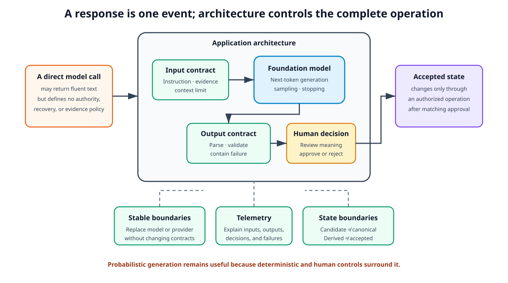
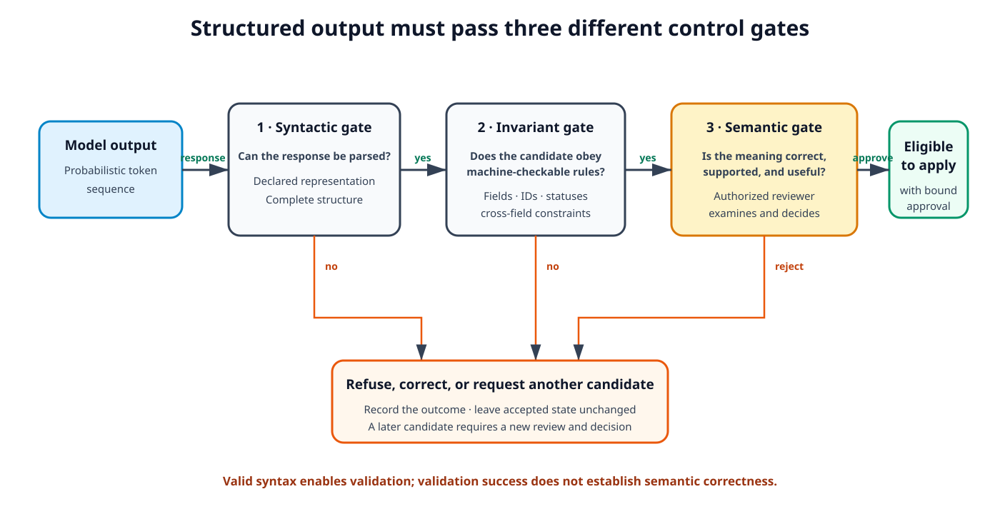
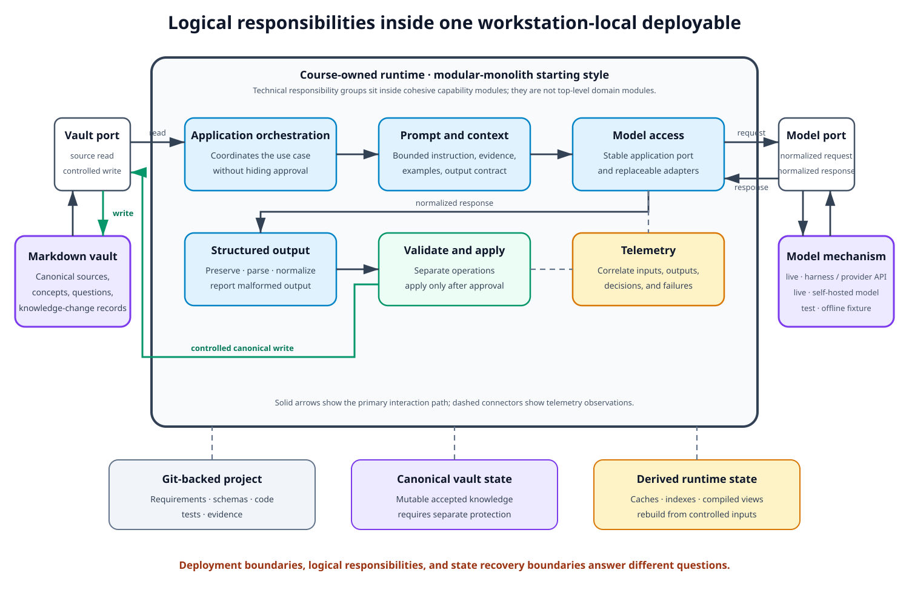
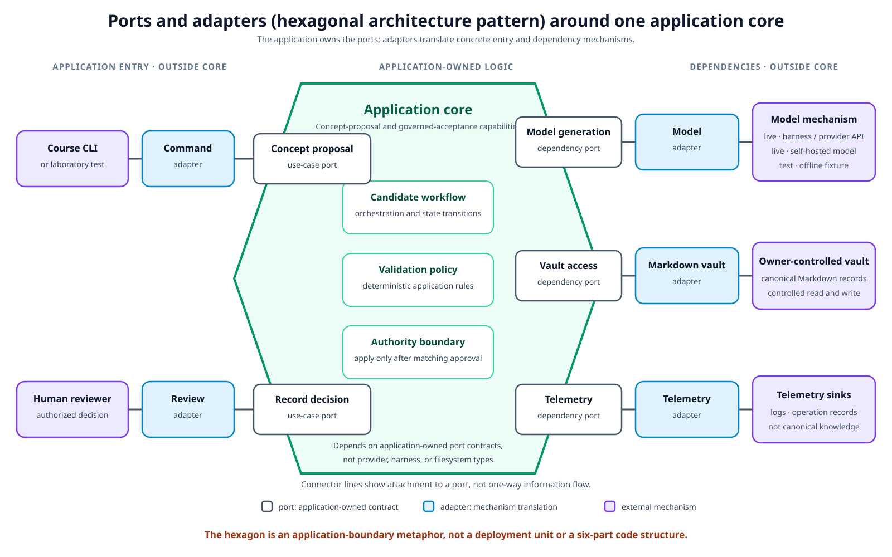
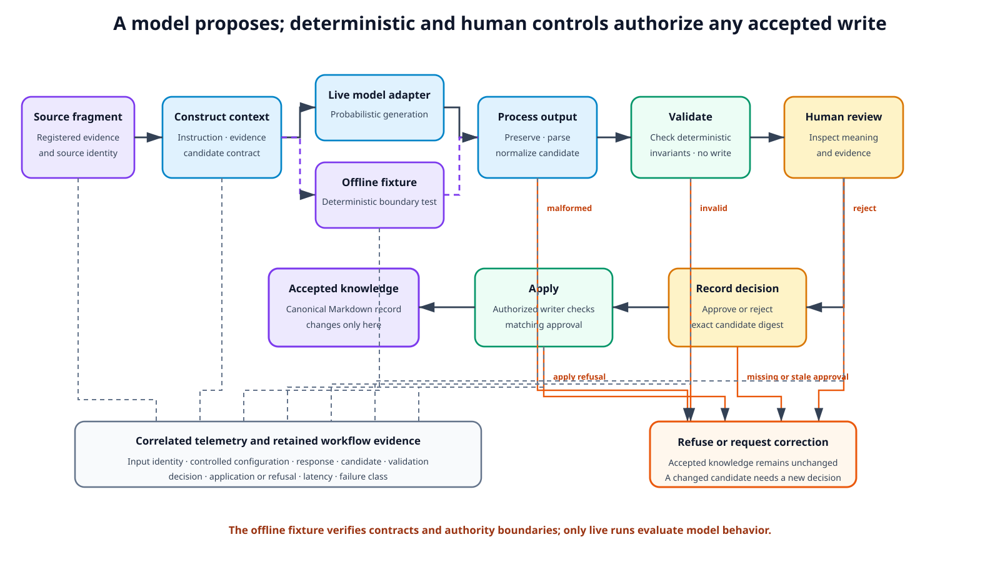

# Module 02: Foundation Models and AI Application Architecture — Theory

> **Status:** Ready for Students — English theory approved as part of the Module 02 English pair on 2026-09-17
>
## Engineering problem: a model response is not an application architecture

A software team gives a source fragment to a foundation model and asks for a concise concept definition. The model returns fluent text in seconds. A second request returns a different definition. A third response looks like the requested JSON object but omits a required field. Another response is syntactically valid yet misrepresents the source.

These outcomes do not mean that the model is useless. They show that model capability and application architecture answer different questions. A model can generate a candidate, but its response alone does not define the following parts of the application:

- the input boundary;
- the output contract;
- failure containment;
- the evidence trail;
- the replacement strategy; or
- the authority to change accepted state.

A direct model call can support a demonstration; a dependable application requires surrounding structure and explicit decisions [1, Chapter 10, “AI Engineering Architecture”].

**Figure 1.** A model response is one event inside a larger system. The application architecture supplies the contracts, deterministic controls, human authority, external-state boundaries, and telemetry needed to turn probabilistic output into a governed operation.

This module addresses one central question:

> How should a software team structure an application around a probabilistic foundation model so that model behavior remains bounded, replaceable, observable, and subject to deterministic and human control?

The answer follows one applied reasoning path:

1. identify the model behaviors that affect application design;
2. recall a minimal software-architecture framework;
3. apply that framework to the supplied learning knowledge system;
4. compare architecture alternatives; and
5. record one worked decision for a model-backed concept-proposal operation.

## Learning outcomes

The outcomes describe observable reasoning that can be applied to a foundation-model application rather than a list of model features. After completing the module, a student should be able to:

1. explain how tokenization, context limits, next-token generation, sampling, stopping conditions, and structured output affect application behavior and failure modes;
2. distinguish syntactically structured model output from semantically valid application data and explain why deterministic validation cannot replace human semantic review;
3. analyze the supplied learning knowledge system through architecture characteristics, logical components, architecture style, and architecture decisions; and
4. justify model-access, adaptation, and authority-boundary decisions through explicit trade-offs rather than product preference.

## 1. Model behavior and output contracts

Application risks begin in the behavior of the model, not in the name of a framework or provider. A small set of model concepts is sufficient to explain why deterministic software boundaries remain necessary around a foundation model.

### 1.1 Tokenization and context are application constraints

A **token** is a unit processed by a language model. A token may represent a word, part of a word, punctuation, or another learned unit. **Tokenization** converts text into a sequence of these units according to the model's tokenizer and vocabulary. Consequently, text length measured in characters or words does not map exactly to model input length [1, Chapter 1, “Language models”].

A model processes a bounded sequence of tokens. Its **context window** limits the combined input that can participate in one generation operation, including instructions, examples, conversation history, source evidence, tool results, and space reserved for the output. This creates several application-level consequences:

- the application must decide which evidence enters the context instead of assuming that every available record can be included;
- longer inputs consume more processing time and may increase operating cost;
- reaching a token limit can truncate either the supplied context or the generated output;
- information placed inside a long context may not influence the model uniformly, because models can use information near the beginning and end more effectively than information in the middle;
- a provider or model change can alter the available context length and therefore invalidate assumptions in context-construction logic.

A large advertised context window is therefore not a substitute for explicit context construction. The application must preserve the source material independently, select the evidence needed for the operation, and detect when the request or expected output cannot fit within the selected model boundary.

> **Further reading:** [1], Chapter 1, “Language models,” working-copy PDF pp. 36–43, for tokenization and autoregressive language models; Chapter 5, “Context Length and Context Efficiency,” pp. 428–431, for context limits and uneven use of long context. Working-copy pagination is edition-specific.

### 1.2 Next-token generation creates variable behavior

An autoregressive language model produces text one token at a time. For each position, it performs the same generation cycle:

1. calculate scores for possible next tokens;
2. transform those scores into a probability distribution;
3. select a token according to a decoding procedure;
4. append the selected token; and
5. repeat the operation for the next position.

The generated sequence ends when the model selects an end-of-sequence token, encounters another configured stop condition, or reaches the maximum output length [1, Chapter 2, “Sampling”].

The decoding procedure determines how the probability distribution becomes an output. **Greedy decoding** selects the highest-probability token at each step. **Sampling** selects among possible tokens according to their probabilities. Parameters such as temperature and top-p modify which alternatives are likely to be selected. Lower variability can make responses more consistent, while higher variability can increase diversity and also increase incoherence or unexpected behavior.

These controls do not turn open-ended generation into an ordinary deterministic function. Even when a request, model identifier, temperature, top-p value, and seed remain unchanged, complete reproducibility may not be available through a provider service. Small input changes can also lead to large output changes. The application must therefore treat variability as expected behavior to be evaluated and contained, not as a rare exception caused only by incorrect configuration.

Stopping behavior also affects output contracts. A maximum-token limit can cut a response in the middle of a sentence or structured object. A stop sequence can occur before all required content has been generated. A model can emit a valid prefix of a JSON object without the closing structure. The application must distinguish a normal model response from a complete candidate that satisfies its own contract.

> **Further reading:** [1], Chapter 2, “Sampling,” working-copy PDF pp. 187–199, and “The Probabilistic Nature of AI” and “Inconsistency,” pp. 214–218. The numeric parameter values and provider examples in the source are implementation examples rather than stable course defaults. Working-copy pagination is edition-specific.

### 1.3 Structured output controls syntax, not meaning

**Structured output** is model output intended to follow an explicit machine-readable organization, such as a JSON object with named fields. It is useful when downstream software must parse a response, when a task returns one of a fixed set of labels, or when a model proposes data for a controlled workflow.

A team can improve structural conformance through several methods:

- explicit format instructions;
- examples;
- post-processing;
- retries;
- constrained sampling; or
- model adaptation.

These methods provide different strengths of control. A prompt can request a format but cannot guarantee that the model will follow it. A provider's JSON mode may guarantee valid JSON syntax without guaranteeing the required fields or the truth of their values. Constrained sampling can restrict token choices to a grammar, but it still does not establish whether the resulting statement is supported by evidence [1, Chapter 2, “Structured Outputs”].

A model-backed operation therefore needs three distinct gates. Each gate answers a different question:

1. **Syntactic gate:** Can the response be parsed as the declared representation?
2. **Deterministic invariant gate:** Does the parsed candidate contain the required fields, identifiers, statuses, allowed values, and cross-field relationships?
3. **Semantic acceptance gate:** Does the candidate interpret the source correctly, preserve relevant uncertainty, avoid unsupported claims, and serve the intended learning purpose?

**Figure 2.** Parseable syntax permits deterministic validation, but neither operation grants semantic authority. An authorized human reviewer examines meaning and decides whether the exact candidate may proceed toward accepted state.

The first two gates can be implemented by deterministic software. For the same controlled input and validator version, they should return the same structural result. The third gate requires judgment about meaning and evidence. A schema can prove that a `definition` field exists; it cannot prove that the definition accurately represents the source. A successful validator must therefore never be reported as proof of semantic correctness.

The separation also protects accepted state. The model emits a **candidate proposal**, not a canonical record. Deterministic validation reads the candidate without approving it or changing canonical knowledge. An **authorized human reviewer** is the person accountable for examining the meaning and evidence and recording an explicit decision. In the supplied course project, the student performs this role; the architectural responsibility itself is not specific to an educational setting. Only a separately authorized application operation may write accepted state, and only when the decision still identifies the exact candidate that was reviewed. This authority arrangement is a course application of the structured-output distinction rather than a claim made by the model source itself.

> **Further reading:** [1], Chapter 2, “Structured Outputs,” working-copy PDF pp. 206–214, and Chapter 5, “Specify the output format,” pp. 438–439. The distinction among parseable syntax, deterministic invariants, and semantic acceptance is a course synthesis instantiated by the authority and change-control rules in the supplied [functional brief](../../training-project/requirements/SYSTEM_BRIEF.md) and [requirements baseline](../../training-project/requirements/REQUIREMENTS_BASELINE.md). Working-copy pagination is edition-specific.

## 2. Applied software-architecture bridge

The model behavior above explains why a response needs surrounding controls. Software architecture provides the framework for deciding where those controls belong and why they must remain stable. This section recalls only the concepts needed for the supplied system; it does not repeat a catalog of architecture styles or implementation patterns.

### 2.1 Software architecture and software design

**Software architecture** is the system-level structure and reasoning that organize a software system through four directly related dimensions [2, Chapter 1, “Defining Software Architecture”]:

1. the **architectural characteristics** the system must support;
2. the **logical components** that implement its behavior;
3. the **architectural style** that provides its overall organization; and
4. the **architectural decisions** that justify and constrain its construction.

Architecture is therefore not any one of the following artifacts in isolation:

- a diagram;
- a deployment topology;
- an architecture style; or
- a list of technologies.

A diagram is an **architecture model** that represents selected aspects of an architecture. A style provides an organizational starting point. Technologies realize decisions. None of these artifacts alone describes the complete structure and reasoning.

**Software design** is the comparatively tactical refinement of a system into component internals, interfaces, classes, patterns, and local interaction choices within architectural constraints. It is not limited to the appearance of a user interface. The selection of a class structure, internal algorithm, or local design pattern can belong toward the design end even when no visual interface exists.

Architecture and design are not separated by a rigid lifecycle phase. A decision lies on an architecture–design spectrum. Its position can be assessed through three questions:

- How strategic or tactical is the decision?
- How much effort would construction or later change require?
- How significant are its trade-offs and consequences for the system?

A provider-neutral model interface affects several components, controls an external dependency, and is expensive to remove after provider-specific types spread through the codebase. It is therefore architectural. The name of one private helper function inside an adapter is local, inexpensive to change, and has limited system consequences. It belongs toward software design. The artifact type alone does not determine the classification.

> **Further reading:** [2], Chapter 1, “Defining Software Architecture,” and Chapter 2, “Architecture Versus Design,” “Strategic Versus Tactical Decisions,” “Level of Effort,” and “The Significance of Trade-Offs”; [3], Chapter 1, “The dimensions of software architecture” and “The spectrum between architecture and design.” The EPUB working copies have no stable page numbers.

### 2.2 Four peer dimensions organize the analysis

The four architecture dimensions are peer aspects of one system-level explanation. Their presentation order is instructional rather than a hierarchy. Each dimension answers a distinct question:

1. An **architectural characteristic** identifies a capability or quality critical to system success that must influence structure or policy rather than merely describe domain behavior.
2. A **logical component** is a functional building block with a defined role and responsibility. It does not have to be a process, service, database, queue, or user interface.
3. An **architectural style** is a named overall organization or topology used as the starting structure for satisfying the relevant requirements, characteristics, and component needs.
4. An **architectural decision** is a structural rule or constraint with significant or long-term consequences that records why one alternative was selected over others.

A **requirement** states a need, capability, condition, or constraint. A requirement can make a quality architecturally significant when satisfying it requires structural support. For example, a requirement that canonical knowledge remain unchanged after a failed model operation creates a need for separate candidate, validation, decision, and application boundaries. Merely preferring “safe AI” would not provide the same traceable basis.

A logical architecture describes functional components and their interactions without first deciding that each component is a separate service or deployment unit. A physical architecture adds processes, deployables, databases, external services, communication mechanisms, and deployment boundaries. Moving directly to a physical diagram can conceal unexamined assumptions, such as equating every responsibility with a network service.

An architecture style must also be distinguished from an **architectural pattern**. A style describes an overall organization. A pattern is a contextualized solution to a recurring problem. Ports and adapters can protect application logic from an external model API, but that pattern does not state whether the complete application is one deployable or many services [2, Chapter 9, “Styles Versus Patterns,” and Chapter 20, “Hexagonal architecture”].

### 2.3 Architecture is trade-off reasoning

Architecture decisions are not product rankings or declarations of a universal best structure. Every significant alternative offers advantages and disadvantages. If an analysis shows only benefits, the relevant trade-off has probably not yet been identified [2, Chapter 1, “Laws of Software Architecture”].

A useful analysis compares alternatives in the context of the system's requirements, risks, team capabilities, cost boundary, and operating environment. It asks which negative consequences the system can tolerate and which architecture characteristic has priority when two desirable properties conflict. The objective is the least-worst suitable option for the current context, not the option with the largest number of components or the newest technology [2, Chapter 2, “Analyzing Trade-Offs,” and Chapter 4, “Trade-Offs and Least Worst Architecture”].

An **architecture decision record (ADR)** preserves this reasoning. There is no single mandatory ADR template. The source framework defines five core sections—Title, Status, Context, Decision, and Consequences—and recommends Compliance and Notes. It also permits a separate Alternatives section when the trade-off analysis would otherwise overload Context. This course therefore uses the following eight-section teaching template:

1. **Title and identifier:** assign a unique sequential identifier—commonly a three-digit prefix—and use a concise, predominantly noun-based title for one specific architectural decision.
2. **Status and lifecycle links:** use Request for Comments with a response deadline while wider feedback is being collected; Proposed while approval is pending and implementation is not yet authorized; Accepted after approval and when implementation may begin; and Superseded when a later accepted ADR replaces the decision. A Proposed ADR is revised or rejected rather than superseded. A superseded record and its replacement should link to each other instead of silently rewriting decision history.
3. **Context and forces:** explain the problem, constraints, decision drivers, and circumstances that made a decision necessary.
4. **Alternatives considered:** identify the credible options that were analyzed, summarize their relevant advantages and disadvantages, and state why each non-selected option was not accepted in this context.
5. **Decision and rationale:** state the selected structural rule in direct language and explain why it fits the stated forces better than the alternatives.
6. **Consequences and trade-offs:** record positive and negative effects, including accepted costs, risks, operational obligations, and difficult-to-reverse implications.
7. **Compliance or governance:** state how implementation and continued conformance will be verified, whether through manual review, automated architecture tests or fitness functions, or both. In this usage, governance means enforcing an architectural decision; it is not a synonym for regulatory compliance.
8. **Notes and metadata:** retain the original author, creation date, approval date and approver, last-modified date and editor, modification summary, superseded date, related decisions, and other useful record metadata.

The alternatives section is not a decorative list. It connects the trade-off analysis to the final decision and prevents a future reader from repeating an already rejected option without understanding why it failed under the original forces. The Decision section still needs an explicit rationale; listing rejected alternatives does not by itself justify the selected one.

An ADR is the durable record of an architectural decision, not the decision itself. It communicates one important decision and its rationale. Accepted ADRs normally remain immutable; when circumstances invalidate a decision, a new ADR supersedes the old one and preserves the history. A record is not the complete architecture, and documentation does not make a weak analysis correct merely because it follows a template. Keeping each record concise and the project-wide template consistent is more valuable than adding fields that the team will not maintain.

> **Further reading:** [2], Chapter 1, “Laws of Software Architecture”; Chapter 2, “Analyzing Trade-Offs”; Chapter 21, “Architectural Decision Records” and “Basic Structure”; [3], Chapter 3, “Analyzing trade-offs” and “Architectural decision records (ADRs).” The EPUB working copies have no stable page numbers.

## 3. Supplied reference architecture of the learning knowledge system

The learning knowledge system is a supplied course project. Its primary user owns an external Markdown vault, uses AI assistance to propose interpretations of technical sources, and retains authority over which interpretations become accepted knowledge. The project requirements are given inputs to architecture reasoning rather than an elicitation task or an invitation to invent a different application.

The reference architecture below is one starting structure for satisfying those requirements. It separates logical responsibilities from deployment choices and keeps the distinction between canonical state and rebuildable runtime artifacts visible.

### 3.1 Four selected architecture characteristics

An architecture characteristic belongs in the driving set only when it is critical, structurally influential, and traceable to a requirement or system driver. Selecting every desirable quality creates unnecessary complexity. The reference analysis therefore uses four characteristics that directly express the central question. Their definitions are course applications to this system, not an exhaustive catalog from the source books.

| Characteristic | Meaning in the learning knowledge system | Structural consequence |
|---|---|---|
| **Reliability** | Malformed, incomplete, unavailable, or semantically unsuitable model output must be detected and contained rather than accepted silently. | Candidate output remains separate from canonical knowledge; failures and refusals leave accepted output unchanged. |
| **Controllability** | Deterministic enforcement and the authorized human reviewer's semantic decision authority must remain between a model proposal and accepted state. | Validation, decision, and application remain distinct operations; the model cannot approve or apply its own proposal. |
| **Observability** | The system must retain enough evidence to explain the input, model interaction, candidate, validation, decision, application, and failure behavior. | The model boundary and governed workflow emit correlated logs and records without making telemetry the canonical knowledge store. |
| **Evolvability** | A model, provider, or access mechanism must be replaceable without changing canonical knowledge contracts or bypassing authority controls. | Provider-specific details remain behind a stable model boundary; canonical schemas and workflow rules remain provider-neutral. |

Provider portability is a concrete evolvability objective rather than a fifth characteristic. The following concerns remain important constraints and comparison criteria instead of additional members of the driving set:

- latency;
- cost;
- privacy;
- security; and
- auditability.

These concerns influence decisions where relevant, but adding each one to the driving set would obscure the four properties that shape this bounded reference architecture.

The four characteristics also constrain one another. Three examples make these interactions visible:

- more retries can improve the chance of obtaining a well-formed candidate but increase latency and cost;
- extensive telemetry can improve diagnosis but create privacy risk if prompts or source text are retained without a policy; and
- a human decision gate can increase controllability but also add interaction time.

The architecture must state these consequences rather than presenting each characteristic as independently maximizable.

> **Further reading:** [2], Chapter 4, “Architectural Characteristics and System Design” and “Trade-Offs and Least Worst Architecture”; [3], Chapter 2, “Defining architectural characteristics” and “Limit characteristics to prevent overengineering.” The EPUB working copies have no stable page numbers. The four-characteristic selection is a course application to the supplied requirements.

### 3.2 Six logical component groups

The logical view assigns responsibilities before selecting processes, services, databases, or queues. The six groups below show the functional building blocks needed for the model-backed workflow. They are logical responsibilities, not necessarily one-to-one code modules or deployment units.

1. **Application orchestration** coordinates the use case from a source fragment to a candidate and then through the controlled workflow. It determines the sequence of calls and normalizes operation results. It must not hide semantic approval inside an automatic pipeline.
2. **Prompt and context construction** combines the task instruction, expected output contract, bounded source evidence, and any permitted examples. It records which controlled artifacts contributed to the request. It must not treat the full vault or conversation history as automatically authorized context.
3. **Model access** exposes a stable application-facing operation and translates it into an available agent-harness, provider-API, or self-hosted-model call. It normalizes relevant failures and metadata. Provider request and response types must not become canonical knowledge contracts.
4. **Structured-output processing** preserves the raw response where policy permits, parses the declared representation, and converts it into a candidate owned by the application contract. It reports malformed, truncated, or incomplete output instead of silently filling missing semantic content.
5. **Deterministic validation and controlled application** enforces machine-checkable invariants and writes accepted artifacts only after a matching authorized decision. These responsibilities may reside in one logical component group, but they remain separate operations: validation does not write a decision or accepted state, and application does not invent missing approval.
6. **Telemetry** records enough correlated evidence to reconstruct the model-backed operation, including controlled configuration identifiers, relevant input and output metadata, validation outcomes, decisions, failures, latency, and quota or cost information where available. It supports diagnosis but does not become the only retained copy of a proposal, decision, or canonical concept.

These groups are intentionally more stable than a vendor software development kit. Their interfaces express the application workflow rather than the request and response types of one provider. This keeps a provider change from redefining the domain workflow.

> **Further reading:** [2], Chapter 8, “Defining Logical Components” and “Logical Versus Physical Architecture”; [3], Chapter 4, “Logical components revisited” and “Logical versus physical architecture”; [1], Chapter 10, “AI Engineering Architecture,” working-copy PDF pp. 852–870 and 875–890, for model gateways, guardrails, high-risk write actions, monitoring, and observability. The six-group decomposition is a course application to the supplied system.

### 3.3 Physical view and state boundaries

The initial physical view uses one workstation-local course-owned deployable and two explicit external dependencies: the selected model service and the owner-controlled Markdown vault. Keeping the runtime in one deployment unit avoids introducing several distributed-system costs before a requirement justifies them:

- service discovery;
- additional network-failure paths;
- queue operation;
- distributed tracing; and
- multi-service release coordination.

**Figure 3.** The six logical responsibility groups execute inside one workstation-local deployable. Solid arrows trace one primary interaction in both directions: canonical source read, normalized model request and response, structured-output processing, validation, and controlled canonical write. Dashed connectors show telemetry observations rather than the next business-data stage. The model-access mechanism and canonical Markdown vault remain external dependencies behind explicit ports. Project definitions are Git-backed, canonical knowledge remains in the vault, and derived runtime data can be rebuilt.

The connectors make one model-backed operation legible; they are not an exhaustive dependency graph for every capability in the modular monolith. In particular, a live response returns from the model-access mechanism through the model port and model-access responsibility before structured-output processing begins. During deterministic tests, a fixture supplies the controlled response at the same port without running a model.

The starting style is a **modular monolith**. A modular monolith is deployed as one unit while preserving internal module boundaries around cohesive application capabilities. The six logical groups in Figure 3 are technical responsibilities of the model-backed operation; they are not top-level domain modules or a one-to-one code decomposition. Detailed code modules should preserve cohesive capabilities, such as concept proposal and governed acceptance, and place prompt, model, storage, and telemetry adapters inside or at the edges of those capability boundaries rather than reproduce one global presentation–business–persistence layering scheme [2, Chapter 11, “Topology” and “Style Specifics”; 3, Chapter 7, “Modular monolith?”].

This choice is contextual. A modular monolith supports a small course project with one primary operator, a workstation-local runtime, a constrained cost boundary, and a system direction that will evolve across the modules. It also has limitations: one deployment unit shares operational characteristics, weak boundary governance can collapse the system into an unstructured monolith, and later high scalability or fault-isolation requirements may justify a different style. No current requirement justifies adding a service or queue solely to make the architecture appear more advanced.

The physical view must not collapse distinct state classes into one component diagram. The supplied system defines three recovery boundaries:

- the **Git-backed project** contains course materials, requirements, schemas, commands, tests, student implementation, and laboratory evidence;
- the **external Markdown vault** contains owner-controlled canonical sources, concepts, questions, and retained knowledge-change records;
- **derived runtime state** contains rebuildable embeddings, indexes, caches, compiled graph views, and generated exports.

These state classes describe meaning, ownership, and recovery. They do not imply that each class is a service. Obsidian is an inspection interface for the Markdown vault, not the owner or canonical representation of its knowledge.

> **Further reading:** [2], Chapter 11, “Topology,” “Style Specifics,” “When to Use,” and “When Not to Use”; [3], Chapter 5, “Deployment model: Monolithic versus distributed,” and Chapter 7, “Modular monolith?” and “Why modular monoliths?” The EPUB working copies have no stable page numbers. The project state boundaries are defined by the supplied functional brief and requirements baseline.

### 3.4 Ports and adapters protect external boundaries

The reference architecture uses **ports and adapters**, also called the **hexagonal architecture pattern**, inside the selected style. The full label keeps its category explicit: it is an architectural pattern, not the architecture style of the complete system. A port defines an application-facing interaction. An adapter translates that interaction to a particular external mechanism. The central application logic depends on the port contract rather than on the provider, harness, filesystem library, or user-interface protocol [2, Chapter 20, “Hexagonal architecture”]. The shorter capitalized wording remains only in the quoted source-section title.

The pattern becomes easier to recognize when the application-owned boundary, its ports, and concrete adapters are shown separately. The following course-specific view applies the source pattern to the learning knowledge system. Its connector lines mean that an adapter is attached to a port; they do not assert one-way information flow or execution order.

**Figure 4.** The application core owns use-case ports for concept proposal and authorized human decisions, together with dependency ports for model generation, vault access, and telemetry. Adapters translate between those contracts and the course CLI, review interaction, model mechanisms, Markdown vault, and telemetry sinks. Both sides are outside the application core; their left-to-right placement does not define layers or a processing pipeline. The hexagon makes the boundary visually prominent; its six sides do not prescribe six modules, and the shape does not define a deployment topology.

The model port accepts a bounded generation request expressed through application concepts and returns a normalized raw or structured response. Live adapters can invoke an available agent harness, an optional provider API, or an optional self-hosted model. An offline fixture can implement the same port during deterministic tests, but it is not a model: it returns controlled test responses without running inference. The vault port exposes controlled reads and writes of canonical records without making the application depend on Obsidian or on one storage library.

Ports and adapters does not remove external dependency risk. A provider can still:

- become unavailable;
- change model behavior;
- alter an application programming interface (API); or
- expose a different set of control features.

A filesystem can also become unavailable. The pattern localizes these effects and gives the application one place to enforce translation, failure normalization, and telemetry. Evolvability is achieved only when tests and operational evidence show that the boundary works; drawing a hexagon does not establish it.

The pattern also does not rename the overall style. The system remains a modular monolith with internal ports and adapters. If later requirements justify several independently deployable services, the architecture style would change even if each service continued to use ports and adapters internally. A model gateway is a model-access component that can unify interfaces, fallbacks, access controls, or telemetry; ports and adapters is the general isolation pattern that can place such a gateway, a direct provider client, or another external mechanism behind an application-owned port. A gateway is therefore one possible adapter or realization, not the pattern itself and not the application style.

> **Further reading:** [2], Chapter 9, “Styles Versus Patterns,” and Chapter 20, “Architectural Patterns” and “Hexagonal architecture.” The EPUB working copy has no stable page numbers. [1], Chapter 10, “Model Gateway,” working-copy PDF pp. 867–870, provides a complementary AI-application example of isolating provider interfaces and failures; a model gateway is not identical to the ports-and-adapters pattern.

## 4. Architecture alternatives and decisions

The reference architecture becomes defensible only when it is compared with plausible alternatives. The following decisions are technology-neutral. Each selects a boundary or policy while leaving replaceable implementation details to later software design.

### 4.1 Should application logic call a model provider directly?

The concept-proposal capability must send a generation request and receive a response. The architectural decision is not yet which model to use. It is **where provider-specific knowledge is allowed to appear**. Figure 4 shows the selected boundary in its upper-right chain: application core → model-generation port → model adapter → model mechanism.

The two alternatives place provider knowledge differently:

1. **Direct model coupling.** The concept-proposal or orchestration code imports a provider's software development kit (SDK), constructs that provider's request object, catches its error classes, and interprets its response object. The shortest representation is `concept proposal → provider SDK → provider service`. This removes an initial translation layer and can be reasonable for a disposable experiment. It also means that central application code knows the provider's message format, authentication assumptions, streaming events, rate-limit errors, and other API details.
2. **Stable model boundary.** The application core defines a model-generation port in application terms, such as a bounded generation request, a normalized response, and normalized failure categories. A provider adapter is the only component that imports the provider SDK. It translates the application request into the provider request and translates the provider response or failure back into the port contract. The representation becomes `concept proposal → model-generation port → provider adapter → provider service`.

The difference becomes visible when the provider changes. With direct coupling, every application location that uses provider types or assumptions may need modification. With a stable boundary, the port remains unchanged and a different adapter implements it. The new adapter still requires contract tests, and the new model path still requires semantic evaluation: an adapter makes replacement localized, not automatically behavior-equivalent.

The comparison can therefore be summarized by where the costs appear:

| Question | Direct model coupling | Stable model boundary |
|---|---|---|
| Where is the provider SDK imported? | In application or orchestration code | Only in the provider adapter |
| Which request, response, and error types does the core use? | Provider-owned types | Application-owned normalized types |
| What changes when a different live or test adapter implements model access? | Every affected call path and test | Primarily the adapter; a live replacement also requires semantic evaluation |
| Where can common model-call telemetry and failure normalization occur? | Repeated across call sites | At the model boundary |
| What is the initial cost? | Less mapping code | Port design, translation code, and boundary tests |

The reference architecture selects the stable model boundary because live model access is external, failure-prone, and expected to vary across an agent harness, provider API, or self-hosted model. The same boundary also permits a model-disabled deterministic test adapter, introduced after the live-hosting comparison in Section 4.2. The accepted cost is the additional port, mapping code, and tests. This boundary is an internal application contract; it does not require a separately deployed model gateway.

### 4.2 Provider API or self-hosted model

For most application teams, build-versus-buy reasoning does not mean training a foundation model from scratch. The practical comparison is commonly between access through a commercial service and hosting an available open-weight model. The source compares these alternatives through the following decision criteria [1, Chapter 4, “Model Build Versus Buy”]:

- privacy;
- model capability;
- operating effort;
- cost structure;
- control and inspectability;
- supported features;
- licensing; and
- on-device use.

A provider API can supply capable models, scalable inference, structured-output features, and managed operational controls with little local infrastructure. It also sends data across an external boundary, can impose rate limits and policy changes, may not expose complete sampling or log-probability controls, and can change or withdraw a model.

Self-hosting increases control over model version, deployment location, and some inference behavior. It also transfers serving, capacity, update, security, monitoring, and license-compliance responsibilities to the operating team. Running inference on the operator's workstation can additionally be limited by available hardware.

The supplied project's model-independence and no-paid-mandatory-path constraints therefore keep provider APIs and self-hosted models out of the canonical contract. Model access remains behind an adapter. The mandatory course path must not require either a paid model API or a locally hosted model. Available harness access can provide live generation where permitted, and a team selecting a different live adapter must still evaluate the model-backed operation because the same nominal model can behave differently across serving systems.

#### Separate testing question: verification without live inference

The provider API and self-hosted model answer the live-inference question. They do not answer a separate verification question: how can deterministic acceptance tests exercise parsing, failures, validation, and authority rules when model access is disabled? Both live options consume inference resources and can return variable results. Requirement `QUA-005` instead requires deterministic acceptance tests to run without consuming model quota. This requirement introduces the need for an offline fixture.

An **offline fixture** is therefore not a third model-hosting option. It is a deterministic test substitute for the model adapter. The distinction from a self-hosted model is operational and semantic:

| Question | Self-hosted model | Offline fixture |
|---|---|---|
| Does it load and execute model weights? | Yes | No |
| Where does its output come from? | Inference performed for the current request | A predefined response or failure scenario stored with the tests |
| Can it produce a new response for previously unseen input? | Yes, within the model's capabilities | No; it can return only behavior programmed into the fixture |
| Is output probabilistic or potentially variable? | Yes | No; the same controlled input produces the same test response |
| What infrastructure does it require? | Model files, an inference runtime, memory or accelerator capacity, and serving operations | A test file or in-process adapter and no model-serving infrastructure |
| What can it verify? | The application boundary plus actual serving and model behavior | Parsing, validation, failure handling, authority rules, and unchanged-state guarantees—but not model quality |

A self-hosted model is therefore a **live inference mechanism** under the operator's control. An offline fixture is **test data packaged behind the same port**. The fixture can prove that the application handles a known valid, malformed, refused, or failed response correctly; it cannot prove that a real model will generate an accurate or useful concept candidate.

### 4.3 Free-form text or a structured candidate contract

Free-form text minimizes schema work and can preserve nuance during exploration. It is difficult to validate reliably and unsafe as the direct input to a canonical write. A parser cannot determine consistently which paragraph is the concept definition, which source supports it, or whether an omitted field represents uncertainty or model error.

A structured candidate contract makes expected fields and machine-checkable invariants explicit. It enables deterministic refusal of malformed and incomplete output and supports comparison across repeated runs. Its cost is contract design, parser maintenance, and migration when the candidate representation evolves. It still requires semantic review because a perfectly structured false claim remains false.

The reference architecture therefore uses structured output for the candidate proposal and keeps free-form explanation as supporting evidence where needed. It does not allow either representation to bypass the governed change workflow.

### 4.4 Prompt and context adaptation or fine-tuning

Prompt and context adaptation change instructions, examples, and supplied evidence without changing model weights. They are comparatively fast to revise, easy to version with the application, and suitable for an initial bounded concept-proposal operation. Their effectiveness is constrained by the context window, inference cost, instruction-following capability, and sensitivity to prompt details.

**Fine-tuning** changes a model through additional training. It can improve task behavior or output-format reliability when prompt-based methods have been evaluated and remain insufficient. It requires suitable data, compute, machine-learning expertise, serving support, monitoring, and repeated investment as base models change. It is not a guaranteed solution to missing factual evidence, and prompting and fine-tuning are not mutually exclusive [1, Chapter 7, “When to Finetune,” “Reasons to Finetune,” and “Reasons Not to Finetune”].

The reference architecture begins with controlled prompting and bounded source context. It defers fine-tuning until evaluation demonstrates a stable behavior problem that cannot be solved adequately at the application boundary. Detailed fine-tuning methods and retrieval-augmented generation are outside this module.

### 4.5 Proposal authority or mutation authority

Allowing the model to write a canonical concept immediately after generation minimizes interaction steps. It also makes model variability, malformed output, semantic error, or compromised context a direct canonical-state mutation. The model would effectively approve its own interpretation.

The selected alternative separates proposal authority from approval and application authority through four successive operations:

1. the model creates a candidate;
2. deterministic software validates its structure;
3. an authorized human reviewer corrects and approves or rejects the exact candidate after examining its meaning and evidence; and
4. the application operation writes accepted state only from the matching approved decision.

This boundary adds human interaction time but directly supports reliability and controllability.

> **Further reading:** [1], Chapter 4, “Model Build Versus Buy,” working-copy PDF pp. 359–377; Chapter 5, “Introduction to Prompting” and “In-Context Learning: Zero-Shot and Few-Shot,” pp. 417–423, and “Provide Sufficient Context,” pp. 440–441; Chapter 7, “When to Finetune,” “Reasons to Finetune,” “Reasons Not to Finetune,” and “Finetuning and RAG,” pp. 601–617. The provider examples and market comparisons in the source are time-sensitive; the decision criteria are the durable content. Working-copy pagination is edition-specific.

## 5. Worked trade-off analysis: one model-backed concept proposal

The worked operation adds a bounded capability to the supplied learning knowledge system. Given a short source fragment and its registered source identity, the application asks a model to propose a normalized concept candidate. The candidate may contain a title, definition, supporting source reference, uncertainty note, and other fields allowed by the current course contract. The operation does not give the model authority to write a canonical concept and does not introduce retrieval, a graph index, or fine-tuning.

The operation follows the architecture from Section 3 through eight steps:

1. application orchestration requests a bounded source fragment from the controlled input path;
2. prompt and context construction combines that evidence with the candidate contract;
3. model access invokes an available adapter;
4. structured-output processing preserves and parses the response;
5. deterministic validation checks the candidate without changing canonical state;
6. an authorized human reviewer examines meaning;
7. the reviewer records a decision, after which controlled application may write the accepted change only when approval matches the exact candidate; and
8. telemetry connects the stages and their outcomes.

**Figure 5.** The model produces a candidate, not accepted knowledge. Malformed output, failed invariants, rejection, changed content, or missing approval follows a refusal path and leaves canonical knowledge unchanged. An offline fixture can replace the live model call for deterministic contract verification.

The decision in step 7 is bound to the exact candidate through a Secure Hash Algorithm 256-bit (SHA-256) **content digest**. A content digest is a fixed-length fingerprint of exact content bytes. SHA-256 maps those bytes deterministically to a 256-bit value. Changing the bytes ordinarily changes that value [4, “Explanation”]. The binding therefore supports two uses:

1. exact-content identification of the reviewed candidate;
2. later change detection.

It does not prove the following:

- semantic correctness of the candidate;
- human identity of the author or reviewer;
- authentication of the operator;
- authorization to approve or apply the change.

The alternatives can now be compared against the four selected characteristics. The table records directional effects rather than numerical scores because representative measurements belong to the evaluation work in Module 03.

| Decision | Reliability | Controllability | Observability | Evolvability | Cost or limitation accepted |
|---|---|---|---|---|---|
| Put model access behind a stable port | Contains provider failures and response translation at one boundary | Prevents provider code from owning workflow rules | Creates one location for normalized model telemetry | Supports adapter replacement | Requires mapping and boundary tests |
| Use a structured candidate contract | Detects malformed and incomplete candidates before acceptance | Gives deterministic validation an explicit scope | Preserves comparable raw, parsed, and validation evidence | Keeps candidate meaning independent of provider response types | Requires schema design and migration |
| Begin with prompt and bounded context | Keeps source evidence explicit and versionable | Leaves acceptance policy outside model weights | Makes instructions and context identifiable artifacts | Avoids an early training and serving dependency | Remains sensitive to context limits and model behavior |
| Separate proposal, decision, and application | Failed or unsuitable output cannot write canonical state directly | Reserves semantic authority for an authorized human reviewer | Produces distinct proposal, decision, application, and refusal evidence | Preserves the same governance contract when the model changes | Adds human latency and workflow steps |
| Keep a model-disabled fixture path | Allows deterministic boundary tests during outages or exhausted quota | Verifies that authority rules do not depend on live generation | Produces reproducible validation and failure evidence | Makes the application testable across access mechanisms | Does not evaluate live model quality |

The table above contains several related choices, but an ADR should record one specific architectural decision rather than become an omnibus description of the whole operation. The teaching ADR below therefore focuses on the authority boundary. A production decision log could give the stable model-access port, candidate-contract versioning, and offline fixture path their own ADRs if their independent consequences or lifecycles justify separate records.

### Teaching ADR 001

The eight sections make the selected authority rule and the reasoning behind it independently reviewable.

1. **Title and identifier:** ADR 001 — Governed candidate before canonical application.
2. **Status and lifecycle links:** Proposed. This illustrative record presents an architectural alternative for analysis; it does not itself authorize implementation and supersedes no earlier ADR.
3. **Context and forces:** The system must use AI assistance to propose concept interpretations while preserving an authorized human reviewer's final semantic authority. AI output can be malformed, unsupported, inconsistent, or semantically unsuitable even when it satisfies a schema. Structural validation must neither approve a proposal nor change canonical knowledge, and every failed or refused path must leave accepted output unchanged. The workflow also needs enough evidence to identify the exact candidate that the reviewer examined.
4. **Alternatives considered:**
   - **Allow the model-access component to write canonical knowledge directly.** This minimizes workflow steps, but it was not selected because provider or generation behavior would then control accepted state and a malformed, unsuitable, or partially failed operation could bypass human decision authority.
   - **Return free-form text for an authorized human reviewer to copy manually.** This preserves a human action before mutation, but it was not selected because the application could not reliably parse or validate the candidate, bind a decision to exact structured content, or produce consistent proposal and refusal evidence.
   - **Automatically apply structured output after schema validation.** This contains syntax and shape errors, but it was not selected because schema conformance does not establish semantic correctness and therefore cannot replace the reviewer's decision.
   - **Create a structured candidate, validate deterministic invariants, obtain a decision bound to the exact candidate, and apply only an approved candidate.** This option was selected because it separates probabilistic assistance, machine-checkable enforcement, human semantic authority, and canonical mutation.
5. **Decision and rationale:** The application will treat every model-generated concept interpretation as a candidate. Candidate creation, deterministic validation, an authorized human decision, and controlled application will remain separate observable operations. Validation will not create approval or mutate canonical state. Application will proceed only when an approval identifies the exact unchanged candidate; all other outcomes will refuse mutation. This rule is selected because, unlike direct mutation, it keeps generated output outside accepted state; unlike free-form manual copying, it creates a stable object for validation and decision binding; and unlike automatic application after schema validation, it preserves human semantic authority. The decision does not select a paid or local model, a final concept schema, retrieval, graph materialization, distributed deployment, or fine-tuning.
6. **Consequences and trade-offs:**
   - **Positive consequences:** malformed output is contained before application; semantic authority remains with the authorized human reviewer; approval is traceable to reviewed content; and provider changes do not acquire canonical-write authority.
   - **Negative consequences and accepted costs:** the application needs proposal and decision artifacts, candidate identity and content-digest handling, explicit refusal paths, additional telemetry, and a human interaction step that increases completion latency.
7. **Compliance or governance:** automated acceptance tests will verify that validation creates neither approval nor canonical mutation, that approval is bound to the exact candidate, and that malformed, failed, changed, unavailable, rejected, or unapproved candidates leave accepted output unchanged. Review of the operation flow will verify that every canonical application is preceded by the matching candidate, validation result, and authorized human decision. These checks govern the candidate-before-application rule without deciding which model adapter or test fixture must implement it.
8. **Notes and metadata:** this is an illustrative course record. Related candidate ADRs concern the stable model-access port, the structured candidate contract, and the model-disabled fixture path. Superseded date and superseding ADR: not applicable.

This decision is architectural because it affects accepted-state authority, multiple logical components, testability, and future change effort. The exact class names, prompt wording, parser library, and adapter internals remain software-design choices unless later evidence makes one of them structurally significant.

> **Further reading:** [2], Chapter 2, “Analyzing Trade-Offs,” and Chapter 21, “Architectural Decision Records” and “Basic Structure”; [3], Chapter 3, “Analyzing trade-offs” and “Architectural decision records (ADRs).” The EPUB working copies have no stable page numbers. SHA-256 is defined by [4, “Explanation”]. The worked operation applies those frameworks to the supplied functional brief and requirements baseline. The content-digest binding is a course control that uses [4]; it does not replace the architecture sources or prescribe a later laboratory file layout.

## 6. Risks, failure modes, and evaluation criteria

The architecture should be tested against failures that follow from probabilistic generation and external dependencies. At this stage, evaluation identifies what must be observed and preserved. Module 03 develops representative cases, experiment design, metrics, and quality thresholds.

1. **Malformed or incomplete output.** The response may be invalid JSON, omit a required field, or stop before the structured object is complete. Parsing and deterministic validation must refuse the candidate. A retry can be permitted by policy, but it increases latency and cost and must not conceal repeated failure.
2. **Syntactically valid but semantically unsuitable output.** Every field may satisfy the schema while the definition contradicts the source, invents a relation, or hides uncertainty. The candidate can pass deterministic validation and still require correction or rejection during semantic review.
3. **Run-to-run variability.** The same source and instruction can produce different candidates. The system must preserve the exact candidate reviewed, bind the decision to that candidate, and avoid treating one favorable output as proof of stable quality.
4. **Model or access failure.** A provider can be unavailable, rate-limited, or inaccessible because quota is exhausted. The operation must fail explicitly without changing accepted knowledge. Deterministic contract tests must remain executable with model access disabled.
5. **Provider or model change.** An API schema, default behavior, underlying model, or safety policy can change. The model adapter should normalize the external difference, while evaluation determines whether the new behavior remains acceptable. A successful adapter test does not prove equivalent semantic quality.
6. **Unauthorized mutation.** A model, retry loop, or combined validation-and-application function can bypass the authorized human decision boundary. The architecture must make candidate creation, decision, and application separate observable operations and ensure that refusal leaves accepted output unchanged.
7. **Insufficient evidence.** Telemetry may record only the final response without identifying the source fragment, prompt version, model path, candidate, validation result, or decision. The team would then be unable to explain a failure or reproduce the reviewed operation. Evidence retention must be sufficient for diagnosis while respecting privacy and secret-handling constraints.
8. **Overengineering.** A distributed deployment, elaborate model router, fine-tuning pipeline, or complete observability platform can add more failure points than the bounded course operation needs. New components are justified only when evaluation exposes a requirement that the simpler reference architecture cannot satisfy.

The initial evaluation boundary follows directly from these risks. A model-backed concept-proposal operation is not accepted merely because it produced a fluent response. The application must demonstrate the following observable properties:

- malformed and incomplete responses are detected;
- deterministic validation is repeatable for the same controlled candidate and validator version;
- validation creates neither an approval decision nor accepted state;
- semantic review can reject a structurally valid candidate;
- changed candidate content invalidates a previous decision for application;
- failed, refused, unavailable, or rejected operations leave accepted output unchanged;
- evidence identifies the input, relevant controlled configuration, candidate, validation outcome, decision, and application or refusal result;
- canonical contracts remain independent of the selected model-access adapter;
- deterministic acceptance tests run without consuming model quota.

These properties evaluate the architecture boundary. They do not measure whether model-generated definitions are consistently accurate, sufficiently grounded, or useful across representative cases. Those questions require an explicit experiment design and become the focus of Module 03.

> **Further reading:** [1], Chapter 2, “The Probabilistic Nature of AI” and “Inconsistency,” working-copy PDF pp. 214–218; Chapter 10, “Monitoring and Observability,” pp. 877–890. The course authority and unchanged-output criteria are defined by the supplied functional brief and requirements baseline. Working-copy pagination is edition-specific.

## Discussion questions

The questions require architecture reasoning rather than product preference. Each answer should identify the relevant characteristic, boundary, trade-off, or evidence.

1. A model returns parseable JSON containing an unsupported concept definition. Which control gate can succeed, which gate must fail, and why?
2. Provider-specific fields appear in the canonical concept record. Which architecture characteristic is weakened, and where should the translation occur instead?
3. Why does the use of ports and adapters not determine whether the complete application is a modular monolith or a distributed system?
4. Two runs use the same source fragment and produce different candidates. Which artifacts and decisions must remain exact for the operation to preserve controllability and observability?
5. A self-hosted model satisfies the privacy constraint but writes directly to the Markdown vault. Which part of the architecture remains unacceptable despite the deployment location?
6. What evidence would justify moving from prompt and context adaptation to fine-tuning for the concept-proposal operation?
7. A team combines validation and application into one function but asks an authorized human reviewer to click “Confirm” first. Which failure paths must be examined before this design can claim to preserve human decision authority?
8. Which new requirement could justify replacing the workstation-local monolith with independently deployable services, and which added operational costs would then need to be accepted?

## Connection to Laboratory 02 and Module 03

Laboratory 02 will exercise the supplied reference architecture rather than assign a second architecture-design task. A bounded model-backed operation will turn a small source fragment into a structured candidate proposal. Deterministic software will validate its contract, and the student, acting as the authorized human reviewer in the laboratory scenario, will examine its meaning and retain decision authority. No model response will write canonical knowledge directly. Each decision will be bound to the reviewed candidate by a SHA-256 content digest: the digest identifies the exact bytes and detects later change, and it does not replace semantic review or prove identity, authentication, or authorization. Repeated or perturbed runs will make model variability observable, while an offline fixture path will support deterministic verification without model quota.

Module 03 continues from this architecture boundary into evaluation and experiment design. It will determine how representative cases, repeated runs, component-level checks, end-to-end outcomes, and explicit quality criteria can show whether the model-backed operation is sufficiently reliable and useful.

## Section-to-source map

The map distinguishes literature-supported concepts from their course-specific application to the learning knowledge system. The supplied project contracts provide system requirements and authority rules; they do not replace the literature as the source of general model or architecture concepts.

| Theory section | Primary source basis | Supporting or course-specific basis |
|---|---|---|
| Engineering problem and outcomes | [1], Chapter 10, “AI Engineering Architecture,” working-copy PDF pp. 852–854 | Supplied learning-system functional brief and requirements baseline; original course synthesis for the central question |
| Model behavior and output contracts | [1], Chapter 1, “Language models,” pp. 36–43; Chapter 2, “Sampling,” pp. 187–199, “Structured Outputs,” pp. 206–214, and “The Probabilistic Nature of AI” and “Inconsistency,” pp. 214–218; Chapter 5, “Context Length and Context Efficiency,” pp. 428–431, and “Specify the output format,” pp. 438–439 | Course synthesis for the syntax–invariants–semantic-acceptance distinction, instantiated by the supplied authority contract |
| Applied software-architecture bridge | [2], Chapter 1, “Defining Software Architecture” and “Laws of Software Architecture”; Chapter 2, “Architecture Versus Design,” the three spectrum sections, and “Analyzing Trade-Offs” | [3], Chapter 1, “The dimensions of software architecture” and “The spectrum between architecture and design”; prior software-architecture course as terminology continuity only |
| Characteristics and logical components | [2], Chapter 4, “Architectural Characteristics and System Design” and “Trade-Offs and Least Worst Architecture”; Chapter 8, “Defining Logical Components” and “Logical Versus Physical Architecture” | [3], Chapter 2, “Limit characteristics to prevent overengineering,” and Chapter 4, “Logical components revisited” and “Logical versus physical architecture”; supplied requirements for the selected characteristics and component responsibilities |
| Initial style, state boundaries, and internal pattern | [2], Chapter 9, “Styles Versus Patterns”; Chapter 11, “Topology,” “Style Specifics,” “When to Use,” and “When Not to Use”; Chapter 20, “Hexagonal architecture” | [3], Chapter 5, “Deployment model: Monolithic versus distributed,” and Chapter 7, “Modular monolith?” and “Why modular monoliths?”; supplied functional brief for state ownership and recovery boundaries |
| Model-access and adaptation alternatives | [1], Chapter 4, “Model Build Versus Buy,” pp. 359–377; Chapter 5, “Introduction to Prompting,” “In-Context Learning: Zero-Shot and Few-Shot,” pp. 417–423, and “Provide Sufficient Context,” pp. 440–441; Chapter 7, “When to Finetune,” “Reasons to Finetune,” “Reasons Not to Finetune,” and “Finetuning and RAG,” pp. 601–617 | Course application behind the stable model boundary and no-paid-mandatory-path requirement |
| Reference architecture and observability | [1], Chapter 10, “AI Engineering Architecture,” pp. 852–870 and 875–890, especially model gateways, high-risk write actions, monitoring, and observability | Supplied state, authority, evidence, model-independence, and quota-free-verification requirements |
| Worked trade-off analysis and decision record | [2], Chapter 2, “Analyzing Trade-Offs,” and Chapter 21, “Architectural Decision Records” and “Basic Structure” | [3], Chapter 3, “Analyzing trade-offs” and “Architectural decision records (ADRs)”; [4], “Explanation,” for SHA-256 content-digest behavior; supplied functional brief and requirements baseline for the worked operation |
| Failure modes, evaluation, and transition | [1], Chapter 2, “The Probabilistic Nature of AI” and “Inconsistency,” pp. 214–218; Chapter 10, “Monitoring and Observability,” pp. 877–890 | Supplied project requirements; course sequence into Laboratory 02 and Module 03 |

## Sources and illustration provenance

The module uses the following books as its principal literature sources:

1. Chip Huyen. *AI Engineering: Building Applications with Foundation Models*. First edition. O'Reilly Media, 2025. Selected sections from Chapters 1, 2, 4, 5, 7, and 10.
2. Mark Richards and Neal Ford. *Fundamentals of Software Architecture: An Engineering Approach*. Second edition. O'Reilly Media, 2025. Selected sections from Chapters 1, 2, 4, 8, 9, 11, 20, and 21.
3. Raju Gandhi, Mark Richards, and Neal Ford. *Head First Software Architecture*. First edition. O'Reilly Media, 2024. Selected sections from Chapters 1–5 and 7.
4. National Institute of Standards and Technology. *Secure Hash Standard (SHS)*. FIPS PUB 180-4. August 2015. https://doi.org/10.6028/NIST.FIPS.180-4.

The course-specific reference architecture and authority boundaries also use two supplied project contracts:

- [Learning Knowledge System — Functional Brief](../../training-project/requirements/SYSTEM_BRIEF.md);
- [Learning Knowledge System — Requirements Baseline](../../training-project/requirements/REQUIREMENTS_BASELINE.md).

Figures 1–5 are original course diagrams created for this module. They are not extracted or copied source figures:

- `images/model-response-and-application-architecture.svg` — original explanation of the difference between model generation and application structure;
- `images/structured-output-control-gates.svg` — original three-gate explanation of syntax, deterministic invariants, and semantic acceptance;
- `images/learning-system-reference-architecture.svg` — original logical and physical view of the supplied reference architecture;
- `images/ports-and-adapters-learning-system.svg` — original application of the hexagonal architecture pattern to the learning knowledge system;
- `images/model-backed-concept-proposal.svg` — original operation flow for a bounded model-backed concept proposal and its refusal paths.
