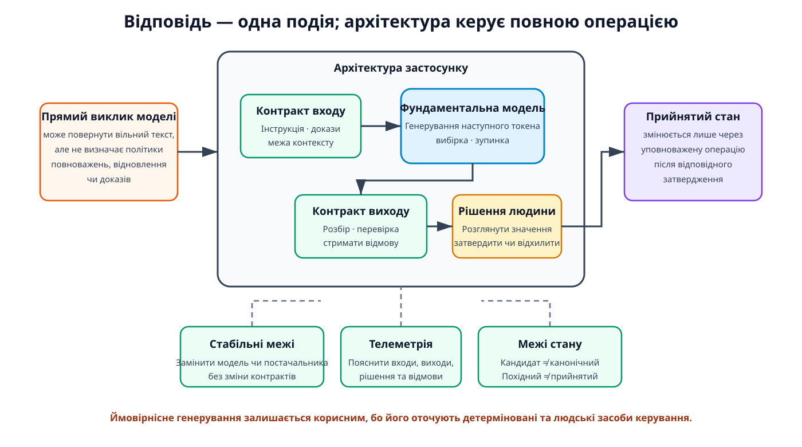
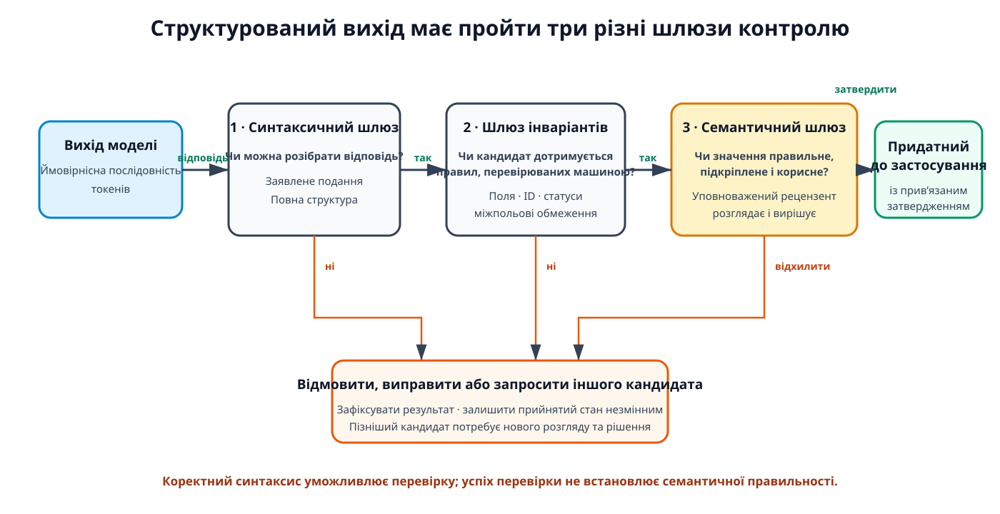
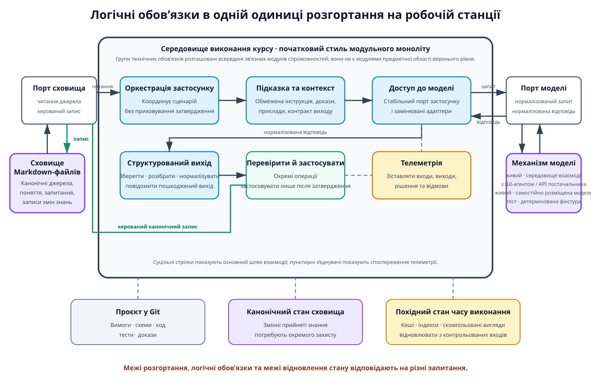
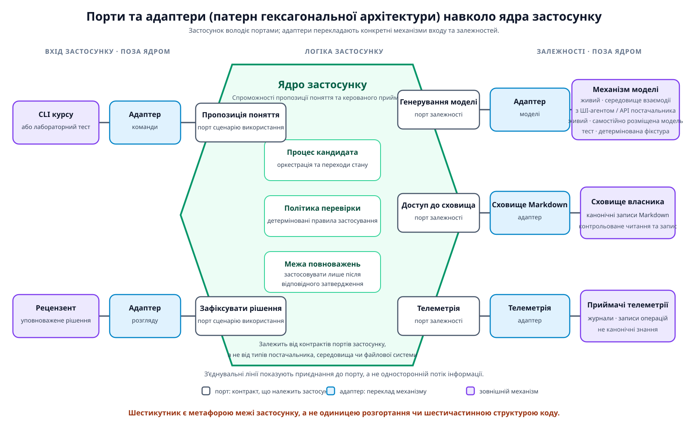
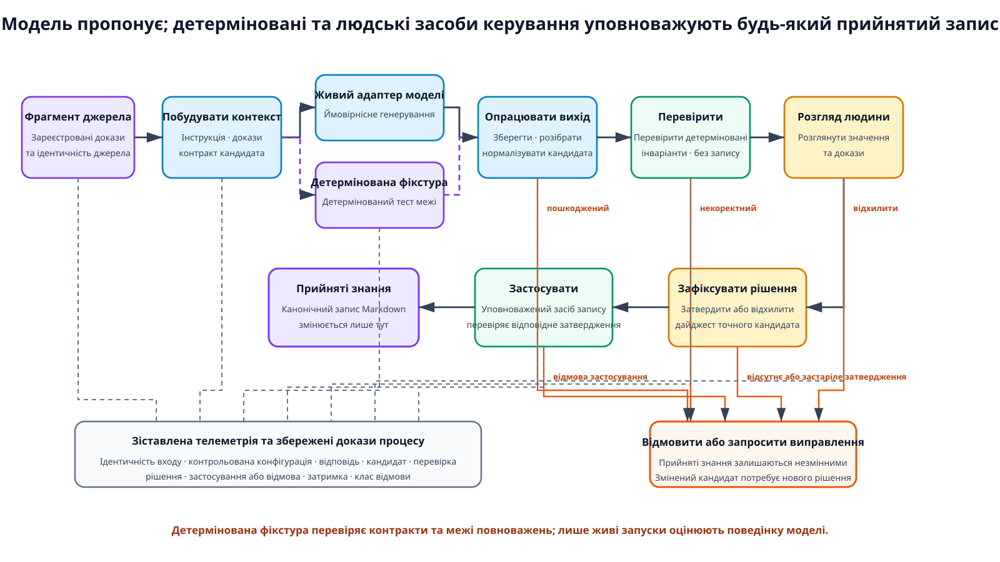

# Модуль 02: Фундаментальні моделі та архітектура застосунків ШІ — Теорія

> **Статус:** Ready for Students — англомовну теорію затверджено як частину англомовної пари модуля 02 2026-09-17
>
## Інженерна проблема: відповідь моделі — це не архітектура застосунку

Команда розробників програмного забезпечення передає фрагмент джерела фундаментальній моделі й просить стисле визначення поняття. Модель за секунди повертає вільний текст. Другий запит повертає інше визначення. Третя відповідь виглядає як запитаний JSON-об’єкт, але пропускає обов’язкове поле. Ще одна відповідь синтаксично коректна, проте викривлює джерело.

Ці результати не означають, що модель марна. Вони показують, що спроможність моделі та архітектура застосунку відповідають на різні запитання. Модель може згенерувати кандидата, але сама її відповідь не визначає таких частин застосунку:

- межу входу;
- контракт виходу;
- стримування відмов;
- слід доказів;
- стратегію заміни; або
- повноваження змінювати прийнятий стан.

Прямий виклик моделі може підтримати демонстрацію; надійний застосунок потребує навколишньої структури та явних рішень [1, Chapter 10, “AI Engineering Architecture”].

**Рисунок 1.** Відповідь моделі — це одна подія всередині більшої системи. Архітектура застосунку постачає контракти, детерміновані засоби керування, повноваження людини, межі зовнішнього стану та телеметрію, потрібні для того, щоб перетворити ймовірнісний вихід на керовану операцію.

Цей модуль розглядає одне центральне запитання:

> Як команді розробників програмного забезпечення структурувати застосунок навколо ймовірнісної фундаментальної моделі так, щоб поведінка моделі залишалася обмеженою, замінюваною, спостережуваною та підпорядкованою детермінованому й людському контролю?

Відповідь іде одним прикладним шляхом міркування:

1. визначити поведінки моделі, які впливають на проєктування застосунку;
2. згадати мінімальну рамку архітектури програмного забезпечення;
3. застосувати цю рамку до наданої навчальної системи знань;
4. порівняти архітектурні альтернативи; і
5. зафіксувати одне опрацьоване рішення для операції пропозиції поняття з використанням моделі.

## Результати навчання

Результати описують спостережуване міркування, яке можна застосувати до застосунку на основі фундаментальної моделі, а не перелік властивостей моделі. Після завершення модуля студент має бути здатний:

1. пояснювати, як токенізація, межі контексту, генерування наступного токена, вибірка, умови зупинки та структурований вихід впливають на поведінку застосунку та типи відмов;
2. розрізняти синтаксично структурований вихід моделі та семантично коректні дані застосунку й пояснювати, чому детермінована перевірка не може замінити семантичний розгляд людини;
3. аналізувати надану навчальну систему знань через архітектурні характеристики, логічні компоненти, архітектурний стиль і архітектурні рішення; і
4. обґрунтовувати рішення щодо доступу до моделі, адаптації та меж повноважень через явні компроміси, а не через уподобання продукту.

## 1. Поведінка моделі та контракти виходу

Ризики застосунку починаються в поведінці моделі, а не в назві рамки чи постачальника. Невеликого набору понять моделі достатньо, щоб пояснити, чому навколо фундаментальної моделі й надалі потрібні детерміновані програмні межі.

### 1.1 Токенізація та контекст є обмеженнями застосунку

**Токен** — це одиниця, яку опрацьовує мовна модель. Токен може відповідати слову, частині слова, знаку пунктуації або іншій вивченій одиниці. **Токенізація** перетворює текст на послідовність цих одиниць згідно з токенізатором і словником моделі. Отже, довжина тексту, виміряна в символах або словах, не відображається точно на довжину входу моделі [1, Chapter 1, “Language models”].

Модель опрацьовує обмежену послідовність токенів. Її **вікно контексту** обмежує сукупний вхід, який може брати участь в одній операції генерування, зокрема інструкції, приклади, історію розмови, джерельні докази, результати інструментів і місце, зарезервоване для виходу. З цього випливає кілька наслідків на рівні застосунку:

- застосунок має вирішувати, які докази потрапляють у контекст, замість припускати, що можна включити кожен доступний запис;
- довші входи споживають більше часу опрацювання і можуть збільшувати експлуатаційну вартість;
- досягнення межі токенів може обрізати або наданий контекст, або згенерований вихід;
- інформація, розміщена всередині довгого контексту, може впливати на модель нерівномірно, бо моделі здатні ефективніше використовувати інформацію на початку та в кінці, ніж інформацію в середині;
- зміна постачальника або моделі може змінити доступну довжину контексту і тим самим зробити недійсними припущення в логіці побудови контексту.

Отже, велике рекламоване вікно контексту не замінює явну побудову контексту. Застосунок має незалежно зберігати вихідний матеріал, добирати докази, потрібні для операції, і виявляти, коли запит або очікуваний вихід не вміщуються в межу вибраної моделі.

> **Додаткове читання:** [1], Chapter 1, “Language models,” working-copy PDF pp. 36–43, щодо токенізації та авторегресійних мовних моделей; Chapter 5, “Context Length and Context Efficiency,” pp. 428–431, щодо меж контексту та нерівномірного використання довгого контексту. Робоча пагінація залежить від видання.

### 1.2 Генерування наступного токена створює змінну поведінку

Авторегресійна мовна модель формує текст по одному токену. Для кожної позиції вона виконує той самий цикл генерування:

1. обчислити оцінки для можливих наступних токенів;
2. перетворити ці оцінки на розподіл імовірностей;
3. обрати токен згідно з процедурою декодування;
4. додати обраний токен; і
5. повторити операцію для наступної позиції.

Згенерована послідовність завершується, коли модель обирає токен кінця послідовності, зустрічає іншу налаштовану умову зупинки або досягає максимальної довжини виходу [1, Chapter 2, “Sampling”].

Процедура декодування визначає, як розподіл імовірностей стає виходом. **Жадібне декодування** на кожному кроці обирає токен із найвищою ймовірністю. **Вибірка** обирає серед можливих токенів згідно з їхніми ймовірностями. Параметри на кшталт temperature і top-p змінюють, які альтернативи, ймовірно, буде обрано. Нижча мінливість може робити відповіді більш узгодженими, тоді як вища мінливість може збільшувати різноманітність і водночас збільшувати незв’язність або несподівану поведінку.

Ці засоби керування не перетворюють відкрите генерування на звичайну детерміновану функцію. Навіть коли запит, ідентифікатор моделі, значення temperature, значення top-p і seed залишаються незмінними, повна відтворюваність через службу постачальника може бути недоступною. Невеликі зміни входу також можуть призводити до великих змін виходу. Тому застосунок має трактувати мінливість як очікувану поведінку, яку потрібно оцінювати й стримувати, а не як рідкісний виняток, спричинений лише неправильною конфігурацією.

Поведінка зупинки також впливає на контракти виходу. Межа максимальної кількості токенів може обрізати відповідь посеред речення або структурованого об’єкта. Стоп-послідовність може трапитися до того, як згенеровано весь потрібний вміст. Модель може видати коректний префікс JSON-об’єкта без завершальної структури. Застосунок має відрізняти звичайну відповідь моделі від повного кандидата, який задовольняє власний контракт застосунку.

> **Додаткове читання:** [1], Chapter 2, “Sampling,” working-copy PDF pp. 187–199, and “The Probabilistic Nature of AI” and “Inconsistency,” pp. 214–218. Числові значення параметрів і приклади постачальників у джерелі є прикладами реалізації, а не стабільними типовими значеннями курсу. Робоча пагінація залежить від видання.

### 1.3 Структурований вихід контролює синтаксис, а не значення

**Структурований вихід** — це вихід моделі, призначений відповідати явній машиночитній організації, наприклад JSON-об’єкту з іменованими полями. Він корисний, коли низхідне програмне забезпечення має розібрати відповідь, коли завдання повертає одну з фіксованої множини міток або коли модель пропонує дані для керованого процесу.

Команда може поліпшити структурну відповідність кількома методами:

- явні інструкції щодо формату;
- приклади;
- постоброблення;
- повторні спроби;
- обмежена вибірка; або
- адаптація моделі.

Ці методи дають різну силу контролю. Підказка може вимагати формат, але не може гарантувати, що модель його дотримається. Режим JSON постачальника може гарантувати коректний синтаксис JSON, не гарантуючи потрібних полів або істинності їхніх значень. Обмежена вибірка може звузити вибір токенів до граматики, але все одно не встановлює, чи підкріплене отримане твердження доказами [1, Chapter 2, “Structured Outputs”].

Отже, операція з використанням моделі потребує трьох різних шлюзів. Кожен шлюз відповідає на інше запитання:

1. **Синтаксичний шлюз:** Чи можна розібрати відповідь як заявлене подання?
2. **Шлюз детермінованих інваріантів:** Чи містить розібраний кандидат потрібні поля, ідентифікатори, статуси, дозволені значення та міжпольові відношення?
3. **Шлюз семантичного приймання:** Чи правильно кандидат інтерпретує джерело, зберігає релевантну невизначеність, уникає непідтверджених тверджень і слугує задуманій навчальній меті?

**Рисунок 2.** Придатний до розбору синтаксис уможливлює детерміновану перевірку, але жодна з цих операцій не надає семантичних повноважень. Уповноважений рецензент розглядає значення і вирішує, чи може точний кандидат просуватися до прийнятого стану.

Перші два шлюзи може реалізувати детерміноване програмне забезпечення. Для того самого контрольованого входу та версії перевіряльника вони мають повертати той самий структурний результат. Третій шлюз потребує судження про значення та докази. Схема може довести, що поле `definition` існує; вона не може довести, що визначення точно відображає джерело. Тому успішний перевіряльник ніколи не можна повідомляти як доказ семантичної правильності.

Розділення також захищає прийнятий стан. Модель видає **кандидатну пропозицію**, а не канонічний запис. Детермінована перевірка читає кандидата, не затверджуючи його і не змінюючи канонічні знання. **Уповноважений рецензент** — це особа, підзвітна за розгляд значення та доказів і за фіксацію явного рішення. У наданому навчальному проєкті цю роль виконує студент; сам архітектурний обов’язок не є специфічним для освітнього середовища. Лише окремо уповноважена операція застосунку може записувати прийнятий стан, і лише тоді, коли рішення й надалі ідентифікує саме того кандидата, якого було розглянуто. Такий устрій повноважень є курсовим застосуванням розрізнення структурованого виходу, а не твердженням самого джерела про модель.

> **Додаткове читання:** [1], Chapter 2, “Structured Outputs,” working-copy PDF pp. 206–214, and Chapter 5, “Specify the output format,” pp. 438–439. Розрізнення між придатним до розбору синтаксисом, детермінованими інваріантами та семантичним прийманням є синтезом курсу, конкретизованим правилами повноважень і контролю змін у наданому [функціональному брифі](../../training-project/requirements/SYSTEM_BRIEF.md) та [базовій лінії вимог](../../training-project/requirements/REQUIREMENTS_BASELINE.md). Робоча пагінація залежить від видання.

## 2. Прикладний місток до архітектури програмного забезпечення

Наведена вище поведінка моделі пояснює, чому відповідь потребує навколишніх засобів керування. Архітектура програмного забезпечення дає рамку для рішення, де ці засоби мають бути розташовані і чому вони мають залишатися стабільними. Цей розділ нагадує лише поняття, потрібні для наданої системи; він не повторює каталог архітектурних стилів чи патернів реалізації.

### 2.1 Архітектура програмного забезпечення та проєктування програмного забезпечення

**Архітектура програмного забезпечення** — це структура та міркування на рівні системи, які організовують програмну систему через чотири безпосередньо пов’язані виміри [2, Chapter 1, “Defining Software Architecture”]:

1. **архітектурні характеристики**, які система має підтримувати;
2. **логічні компоненти**, що реалізують її поведінку;
3. **архітектурний стиль**, який задає її загальну організацію; і
4. **архітектурні рішення**, які обґрунтовують і обмежують її побудову.

Отже, архітектура не є жодним із наведених далі артефактів окремо:

- діаграмою;
- топологією розгортання;
- архітектурним стилем; або
- переліком технологій.

Діаграма є **архітектурною моделлю**, що зображує вибрані аспекти архітектури. Стиль дає організаційну відправну точку. Технології реалізують рішення. Жоден із цих артефактів сам по собі не описує повної структури та міркування.

**Проєктування програмного забезпечення** — це порівняно тактичне уточнення системи до внутрішньої будови компонентів, інтерфейсів, класів, патернів і локальних виборів взаємодії в межах архітектурних обмежень. Воно не зводиться до вигляду інтерфейсу користувача. Вибір структури класів, внутрішнього алгоритму або локального патерна проєктування може належати до кінця спектра проєктування навіть тоді, коли візуального інтерфейсу немає.

Архітектуру та проєктування не розділяє жорстка фаза життєвого циклу. Рішення лежить на спектрі архітектура–проєктування. Його положення можна оцінити через три запитання:

- Наскільки стратегічним або тактичним є рішення?
- Скільки зусиль потребували б побудова або пізніша зміна?
- Наскільки значущі його компроміси та наслідки для системи?

Нейтральний щодо постачальника інтерфейс моделі впливає на кілька компонентів, контролює зовнішню залежність і є дорогим для вилучення після того, як типи, специфічні для постачальника, поширюються кодовою базою. Тому він є архітектурним. Назва однієї приватної допоміжної функції всередині адаптера є локальною, недорогою для зміни і має обмежені системні наслідки. Вона належить до проєктування програмного забезпечення. Сам тип артефакту не визначає класифікації.

> **Додаткове читання:** [2], Chapter 1, “Defining Software Architecture,” and Chapter 2, “Architecture Versus Design,” “Strategic Versus Tactical Decisions,” “Level of Effort,” and “The Significance of Trade-Offs”; [3], Chapter 1, “The dimensions of software architecture” and “The spectrum between architecture and design.” Робочі копії EPUB не мають стабільних номерів сторінок.

### 2.2 Чотири рівноправні виміри організовують аналіз

Чотири виміри архітектури є рівноправними аспектами одного пояснення на рівні системи. Порядок їхнього викладу є навчальним, а не ієрархією. Кожен вимір відповідає на окреме запитання:

1. **Архітектурна характеристика** ідентифікує спроможність або якість, критичну для успіху системи, яка має впливати на структуру або політику, а не лише описувати поведінку предметної області.
2. **Логічний компонент** — це функційний будівельний блок із визначеною роллю та відповідальністю. Він не обов’язково є процесом, службою, базою даних, чергою або інтерфейсом користувача.
3. **Архітектурний стиль** — це названа загальна організація або топологія, яку використовують як початкову структуру для задоволення релевантних вимог, характеристик і потреб компонентів.
4. **Архітектурне рішення** — це структурне правило або обмеження зі значними або довгостроковими наслідками, яке фіксує, чому одну альтернативу було обрано замість інших.

**Вимога** формулює потребу, спроможність, умову або обмеження. Вимога може зробити якість архітектурно значущою, коли її задоволення потребує структурної підтримки. Наприклад, вимога, щоб канонічні знання залишалися незмінними після невдалої операції моделі, створює потребу в окремих межах кандидата, перевірки, рішення та застосування. Саме лише надання переваги «безпечному ШІ» не дало б тієї самої простежуваної основи.

Логічна архітектура описує функційні компоненти та їхню взаємодію, не вирішуючи наперед, що кожен компонент є окремою службою або одиницею розгортання. Фізична архітектура додає процеси, розгортальні одиниці, бази даних, зовнішні служби, механізми комунікації та межі розгортання. Безпосередній перехід до фізичної діаграми може приховати неперевірені припущення, наприклад ототожнення кожної відповідальності з мережевою службою.

Архітектурний стиль також необхідно відрізняти від **архітектурного патерна**. Стиль описує загальну організацію. Патерн є розв’язком повторюваної проблеми в певному контексті. Порти та адаптери можуть захистити логіку застосунку від зовнішнього API моделі, але цей патерн не стверджує, чи повний застосунок є однією розгортальною одиницею, чи багатьма службами [2, Chapter 9, “Styles Versus Patterns,” and Chapter 20, “Hexagonal architecture”].

### 2.3 Архітектура є міркуванням про компроміси

Архітектурні рішення не є рейтингами продуктів і не є деклараціями універсально найкращої структури. Кожна значуща альтернатива пропонує переваги та недоліки. Якщо аналіз показує лише вигоди, релевантний компроміс, імовірно, ще не ідентифіковано [2, Chapter 1, “Laws of Software Architecture”].

Корисний аналіз порівнює альтернативи в контексті вимог системи, ризиків, спроможностей команди, межі вартості та експлуатаційного середовища. Він запитує, які негативні наслідки система може стерпіти і яка архітектурна характеристика має пріоритет, коли дві бажані властивості конфліктують. Метою є найменш поганий придатний варіант для поточного контексту, а не варіант із найбільшою кількістю компонентів або найновішою технологією [2, Chapter 2, “Analyzing Trade-Offs,” and Chapter 4, “Trade-Offs and Least Worst Architecture”].

**Запис архітектурного рішення (Architecture Decision Record, ADR)** зберігає це міркування. Не існує єдиного обов’язкового шаблону ADR. Джерельна рамка визначає п’ять основних розділів — Title, Status, Context, Decision і Consequences — і рекомендує Compliance та Notes. Вона також дозволяє окремий розділ Alternatives, коли аналіз компромісів інакше перевантажив би Context. Тому цей курс використовує такий восьмироздільний навчальний шаблон:

1. **Title and identifier:** призначити унікальний послідовний ідентифікатор — зазвичай трицифровий префікс — і використати стислу, переважно іменникову назву для одного конкретного архітектурного рішення.
2. **Status and lifecycle links:** використовувати Request for Comments із кінцевим терміном відповіді, доки збирається ширший зворотний зв’язок; Proposed, доки затвердження очікується, а реалізацію ще не уповноважено; Accepted після затвердження і коли реалізацію можна починати; і Superseded, коли пізніший прийнятий ADR замінює рішення. Запис зі статусом Proposed переглядають або відхиляють, а не заміщують. Заміщений запис і його заміна мають посилатися один на одного, а не мовчки переписувати історію рішень.
3. **Context and forces:** пояснити проблему, обмеження, рушії рішення та обставини, що зробили рішення необхідним.
4. **Alternatives considered:** ідентифікувати правдоподібні варіанти, які було проаналізовано, стисло викласти їхні релевантні переваги та недоліки і вказати, чому кожен невибраний варіант не було прийнято в цьому контексті.
5. **Decision and rationale:** сформулювати вибране структурне правило прямою мовою і пояснити, чому воно краще відповідає зазначеним силам, ніж альтернативи.
6. **Consequences and trade-offs:** зафіксувати позитивні та негативні наслідки, включно з прийнятими витратами, ризиками, експлуатаційними обов’язками та важкооборотними імплікаціями.
7. **Compliance or governance:** зазначити, як буде перевірено реалізацію та подальшу відповідність — через ручний розгляд, автоматизовані архітектурні тести або функції придатності, чи обидва способи. У цьому вживанні врядування означає забезпечення архітектурного рішення; це не синонім регуляторної відповідності.
8. **Notes and metadata:** зберегти першого автора, дату створення, дату затвердження та затверджувача, дату останньої зміни та редактора, стислий опис зміни, дату заміщення, пов’язані рішення та інші корисні метадані запису.

Розділ альтернатив не є декоративним списком. Він пов’язує аналіз компромісів із кінцевим рішенням і не дає майбутньому читачеві повторити вже відхилений варіант, не розуміючи, чому він не спрацював за початкових сил. Розділ Decision усе одно потребує явного обґрунтування; перелік відхилених альтернатив сам по собі не обґрунтовує вибрану.

ADR є стійким записом архітектурного рішення, а не самим рішенням. Він повідомляє одне важливе рішення та його обґрунтування. Прийняті ADR зазвичай залишаються незмінними; коли обставини роблять рішення недійсним, новий ADR заміщує старий і зберігає історію. Запис не є повною архітектурою, і документація не робить слабкий аналіз правильним лише тому, що він дотримується шаблону. Тримати кожен запис стислим, а загальнопроєктний шаблон узгодженим цінніше, ніж додавати поля, які команда не підтримуватиме.

> **Додаткове читання:** [2], Chapter 1, “Laws of Software Architecture”; Chapter 2, “Analyzing Trade-Offs”; Chapter 21, “Architectural Decision Records” and “Basic Structure”; [3], Chapter 3, “Analyzing trade-offs” and “Architectural decision records (ADRs).” Робочі копії EPUB не мають стабільних номерів сторінок.

## 3. Надана еталонна архітектура навчальної системи знань

Навчальна система знань є наданим навчальним проєктом. Її основний користувач володіє зовнішнім сховищем Markdown-файлів, використовує допомогу ШІ, щоб пропонувати інтерпретації технічних джерел, і зберігає повноваження щодо того, які інтерпретації стають прийнятими знаннями. Вимоги проєкту є заданими входами до архітектурного міркування, а не завданням збору вимог і не запрошенням вигадати інший застосунок.

Наведена далі еталонна архітектура є однією початковою структурою для задоволення цих вимог. Вона відокремлює логічні обов’язки від виборів розгортання і зберігає видимим розрізнення між канонічним станом і відновлюваними артефактами часу виконання.

### 3.1 Чотири вибрані архітектурні характеристики

Архітектурна характеристика належить до керівного набору лише тоді, коли вона є критичною, структурно впливовою та простежуваною до вимоги або системного рушія. Вибір кожної бажаної якості створює зайву складність. Тому еталонний аналіз використовує чотири характеристики, які безпосередньо виражають центральне запитання. Їхні визначення є курсовими застосуваннями до цієї системи, а не вичерпним каталогом із книжок-джерел.

| Характеристика | Значення в навчальній системі знань | Структурний наслідок |
|---|---|---|
| **Надійність** | Пошкоджений, неповний, недоступний або семантично непридатний вихід моделі має бути виявлений і стриманий, а не прийнятий мовчки. | Кандидатний вихід залишається окремим від канонічних знань; відмови та відхилення залишають прийнятий вихід незмінним. |
| **Керованість** | Детерміноване забезпечення правил і семантичні повноваження уповноваженого рецензента щодо рішення мають залишатися між пропозицією моделі та прийнятим станом. | Перевірка, рішення та застосування залишаються окремими операціями; модель не може затвердити або застосувати власну пропозицію. |
| **Спостережуваність** | Система має зберігати достатньо доказів, щоб пояснити вхід, взаємодію з моделлю, кандидата, перевірку, рішення, застосування та поведінку відмови. | Межа моделі та керований процес випускають зіставлені журнали й записи, не роблячи телеметрію канонічним сховищем знань. |
| **Еволюційність** | Команда може замінити модель, постачальника або механізм доступу без зміни контрактів канонічних знань і без обходу засобів контролю повноважень. | Деталі, специфічні для постачальника, залишаються за стабільною межею доступу до моделі; канонічні схеми та правила процесу залишаються нейтральними щодо постачальника. |

Переносимість між постачальниками є конкретним завданням еволюційності, а не п’ятою характеристикою. Наведені далі турботи залишаються важливими обмеженнями та критеріями порівняння, а не додатковими членами керівного набору:

- затримка;
- вартість;
- приватність;
- безпека; і
- можливість аудиту.

Ці турботи впливають на рішення там, де це релевантно, але додавання кожної з них до керівного набору затемнило б чотири властивості, що формують цю обмежену еталонну архітектуру.

Чотири характеристики також обмежують одна одну. Три приклади роблять ці взаємодії видимими:

- більша кількість повторних спроб може підвищити шанс отримати добре сформованого кандидата, але збільшує затримку та вартість;
- обширна телеметрія може поліпшити діагностику, але створює ризик для приватності, якщо підказки або вихідний текст зберігаються без політики; і
- шлюз людського рішення може підвищити керованість, але також додає час взаємодії.

Архітектура має констатувати ці наслідки, а не подавати кожну характеристику як незалежно максимізовну.

> **Додаткове читання:** [2], Chapter 4, “Architectural Characteristics and System Design” and “Trade-Offs and Least Worst Architecture”; [3], Chapter 2, “Defining architectural characteristics” and “Limit characteristics to prevent overengineering.” Робочі копії EPUB не мають стабільних номерів сторінок. Вибір чотирьох характеристик є курсовим застосуванням до наданих вимог.

### 3.2 Шість груп логічних компонентів

Логічний вигляд призначає обов’язки до вибору процесів, служб, баз даних або черг. Шість груп нижче показують функційні будівельні блоки, потрібні для процесу з використанням моделі. Це логічні обов’язки, а не обов’язково модулі коду або одиниці розгортання один до одного.

1. **Оркестрація застосунку** координує сценарій використання від фрагмента джерела до кандидата, а потім через керований процес. Вона визначає послідовність викликів і нормалізує результати операцій. Вона не повинна ховати семантичне затвердження всередині автоматичного конвеєра.
2. **Побудова підказки та контексту** поєднує інструкцію завдання, очікуваний контракт виходу, обмежені джерельні докази та будь-які дозволені приклади. Вона фіксує, які контрольовані артефакти зробили внесок у запит. Вона не повинна трактувати все сховище або історію розмови як автоматично уповноважений контекст.
3. **Доступ до моделі** надає стабільну операцію, звернену до застосунку, і перекладає її на доступний виклик середовища взаємодії з ШІ-агентом, API постачальника або самостійно розміщеної моделі. Він нормалізує релевантні відмови та метадані. Типи запитів і відповідей постачальника не повинні ставати контрактами канонічних знань.
4. **Опрацювання структурованого виходу** зберігає сиру відповідь там, де політика дозволяє, розбирає заявлене подання і перетворює його на кандидата, що належить контракту застосунку. Воно повідомляє пошкоджений, обрізаний або неповний вихід замість того, щоб мовчки заповнювати відсутній семантичний вміст.
5. **Детермінована перевірка та кероване застосування** забезпечує інваріанти, які можна перевірити машиною, і записує прийняті артефакти лише після відповідного уповноваженого рішення. Ці обов’язки можуть перебувати в одній групі логічних компонентів, але залишаються окремими операціями: перевірка не записує рішення чи прийнятий стан, а застосування не вигадує відсутнього затвердження.
6. **Телеметрія** записує достатньо зіставлених доказів, щоб реконструювати операцію з використанням моделі, включно з ідентифікаторами контрольованої конфігурації, релевантними метаданими входу та виходу, результатами перевірки, рішеннями, відмовами, затримкою та інформацією про квоту або вартість, де вона доступна. Вона підтримує діагностику, але не стає єдиною збереженою копією пропозиції, рішення чи канонічного поняття.

Ці групи навмисно стабільніші за комплект засобів розроблення програмного забезпечення постачальника. Їхні інтерфейси виражають процес застосунку, а не типи запитів і відповідей одного постачальника. Це не дає зміні постачальника перевизначити процес предметної області.

> **Додаткове читання:** [2], Chapter 8, “Defining Logical Components” and “Logical Versus Physical Architecture”; [3], Chapter 4, “Logical components revisited” and “Logical versus physical architecture”; [1], Chapter 10, “AI Engineering Architecture,” working-copy PDF pp. 852–870 and 875–890, щодо шлюзів доступу до моделей, захисних бар’єрів, дій запису високого ризику, моніторингу та спостережуваності. Розклад на шість груп є курсовим застосуванням до наданої системи.

### 3.3 Фізичний вигляд і межі стану

Початковий фізичний вигляд використовує одну належну курсу одиницю розгортання на робочій станції та дві явні зовнішні залежності: вибрану службу моделі й контрольоване власником сховище Markdown-файлів. Розміщення середовища виконання в одній одиниці розгортання дає змогу не запроваджувати кілька видів витрат розподіленої системи, доки їх не обґрунтовує вимога:

- виявлення служб;
- додаткові шляхи мережевих відмов;
- роботу черги;
- розподілене трасування; і
- координацію випусків кількох служб.

**Рисунок 3.** Шість груп логічних обов’язків виконуються всередині однієї одиниці розгортання на робочій станції. Суцільні стрілки простежують одну основну взаємодію в обох напрямах: читання канонічного джерела, нормалізований запит і відповідь моделі, опрацювання структурованого виходу, перевірку та керований канонічний запис. Пунктирні з’єднувачі показують спостереження телеметрії, а не наступний етап бізнес-даних. Механізм доступу до моделі та канонічне сховище Markdown-файлів залишаються зовнішніми залежностями за явними портами. Визначення проєкту зберігаються в Git, канонічні знання залишаються у сховищі, а похідні дані часу виконання можна відновити.

З’єднувачі роблять одну операцію з використанням моделі зрозумілою; вони не є вичерпним графом залежностей для кожної спроможності модульного моноліту. Зокрема, жива відповідь повертається від механізму доступу до моделі через порт моделі та обов’язок доступу до моделі перед початком опрацювання структурованого виходу. Під час детермінованих тестів фікстура постачає контрольовану відповідь на тому самому порті без запуску моделі.

Початковим стилем є **модульний моноліт**. Модульний моноліт розгортається як одна одиниця, зберігаючи внутрішні межі модулів навколо зв’язних спроможностей застосунку. Шість логічних груп на Рисунку 3 є технічними обов’язками операції з використанням моделі; вони не є модулями предметної області верхнього рівня і не є розкладом коду один до одного. Детальні модулі коду мають зберігати зв’язні спроможності, такі як пропозиція поняття та кероване приймання, і розміщувати адаптери підказки, моделі, сховища та телеметрії всередині або на межах цих спроможностей, а не відтворювати одну глобальну схему шарів подання–бізнес-логіка–збереження [2, Chapter 11, “Topology” and “Style Specifics”; 3, Chapter 7, “Modular monolith?”].

Цей вибір залежить від контексту. Модульний моноліт підтримує невеликий навчальний проєкт з одним основним оператором, середовищем виконання на робочій станції, обмеженою межею вартості та напрямом системи, який розвиватиметься між модулями. Він також має обмеження: одна одиниця розгортання поділяє експлуатаційні характеристики, слабке врядування меж може згорнути систему в неструктурований моноліт, а пізніші вимоги високої масштабованості або ізоляції відмов можуть обґрунтувати інший стиль. Жодна поточна вимога не обґрунтовує додавання служби чи черги лише для того, щоб архітектура виглядала більш розвиненою.

Фізичний вигляд не повинен згортати різні класи стану в одну діаграму компонентів. Надана система визначає три межі відновлення:

- **проєкт, збережений у Git,** містить навчальні матеріали, вимоги, схеми, команди, тести, реалізацію студента та докази лабораторної роботи;
- **зовнішнє сховище Markdown-файлів** містить канонічні джерела, поняття, запитання та збережені записи змін знань, контрольовані власником;
- **похідний стан часу виконання** містить відновлювані векторні подання, індекси, кеші, скомпільовані графові вигляди та згенеровані експорти.

Ці класи стану описують значення, власність і відновлення. Вони не означають, що кожен клас є службою. Obsidian є інтерфейсом інспекції сховища Markdown-файлів, а не власником і не канонічним поданням його знань.

> **Додаткове читання:** [2], Chapter 11, “Topology,” “Style Specifics,” “When to Use,” and “When Not to Use”; [3], Chapter 5, “Deployment model: Monolithic versus distributed,” and Chapter 7, “Modular monolith?” and “Why modular monoliths?” Робочі копії EPUB не мають стабільних номерів сторінок. Межі стану проєкту визначено наданим функціональним брифом і базовою лінією вимог.

### 3.4 Порти та адаптери захищають зовнішні межі

Еталонна архітектура використовує **порти та адаптери**, також звані **патерном гексагональної архітектури**, всередині вибраного стилю. Повна назва зберігає категорію явною: це архітектурний патерн, а не архітектурний стиль повної системи. Порт визначає взаємодію, звернену до застосунку. Адаптер перекладає цю взаємодію на конкретний зовнішній механізм. Центральна логіка застосунку залежить від контракту порту, а не від постачальника, середовища взаємодії, бібліотеки файлової системи чи протоколу інтерфейсу користувача [2, Chapter 20, “Hexagonal architecture”]. Коротше капіталізоване формулювання залишається лише в цитованій назві розділу джерела.

Патерн легше розпізнати, коли межа, що належить застосунку, її порти та конкретні адаптери показано окремо. Наведений далі курсовий вигляд застосовує джерельний патерн до навчальної системи знань. Його з’єднувальні лінії означають, що адаптер приєднано до порту; вони не стверджують односторонній потік інформації чи порядок виконання.

**Рисунок 4.** Ядро застосунку володіє портами сценаріїв використання для пропозиції поняття та рішень уповноваженого рецензента, а також портами залежностей для генерування моделі, доступу до сховища та телеметрії. Адаптери перекладають між цими контрактами та CLI курсу, взаємодією розгляду, механізмами моделі, сховищем Markdown-файлів і приймачами телеметрії. Обидва боки перебувають поза ядром застосунку; їхнє розміщення зліва направо не визначає шарів і не визначає конвеєра опрацювання. Шестикутник робить межу візуально помітною; його шість сторін не приписують шість модулів, і форма не визначає топології розгортання.

Порт моделі приймає обмежений запит генерування, виражений через поняття застосунку, і повертає нормалізовану сиру або структуровану відповідь. Живі адаптери можуть викликати доступне середовище взаємодії з ШІ-агентом, необов’язковий API постачальника або необов’язкову самостійно розміщену модель. Детермінована тестова фікстура може реалізувати той самий порт під час детермінованих тестів, але вона не є моделлю: вона повертає контрольовані тестові відповіді без запуску виведення. Порт сховища надає контрольовані читання та записи канонічних записів, не змушуючи застосунок залежати від Obsidian або від однієї бібліотеки збереження.

Порти та адаптери не усувають ризику зовнішньої залежності. Постачальник усе ще може:

- стати недоступним;
- змінити поведінку моделі;
- змінити прикладний програмний інтерфейс (API); або
- надати інший набір засобів керування.

Файлова система також може стати недоступною. Патерн локалізує ці ефекти і дає застосунку одне місце для забезпечення перекладу, нормалізації відмов і телеметрії. Еволюційність досягається лише тоді, коли тести та експлуатаційні докази показують, що межа працює; малювання шестикутника цього не встановлює.

Патерн також не перейменовує загальний стиль. Система залишається модульним монолітом із внутрішніми портами та адаптерами. Якщо пізніші вимоги обґрунтують кілька незалежно розгортальних служб, архітектурний стиль змінився б, навіть якби кожна служба й надалі використовувала порти та адаптери внутрішньо. Шлюз доступу до моделей є компонентом доступу до моделі, який може уніфікувати інтерфейси, запасні шляхи, засоби контролю доступу або телеметрію; порти та адаптери — це загальний патерн ізоляції, який може розмістити такий шлюз, прямий клієнт постачальника або інший зовнішній механізм за портом, що належить застосунку. Отже, шлюз є одним можливим адаптером або реалізацією, а не самим патерном і не стилем застосунку.

> **Додаткове читання:** [2], Chapter 9, “Styles Versus Patterns,” and Chapter 20, “Architectural Patterns” and “Hexagonal architecture.” Робоча копія EPUB не має стабільних номерів сторінок. [1], Chapter 10, “Model Gateway,” working-copy PDF pp. 867–870, надає додатковий приклад застосунку ШІ з ізоляції інтерфейсів і відмов постачальника; шлюз доступу до моделей не тотожний патерну портів та адаптерів.

## 4. Архітектурні альтернативи та рішення

Еталонна архітектура стає обґрунтованою лише тоді, коли її порівняно з правдоподібними альтернативами. Наведені далі рішення є технологічно нейтральними. Кожне вибирає межу або політику, залишаючи замінювані деталі реалізації пізнішому проєктуванню програмного забезпечення.

### 4.1 Чи має логіка застосунку викликати постачальника моделі безпосередньо?

Спроможність пропозиції поняття має надіслати запит генерування і отримати відповідь. Архітектурне рішення ще не полягає в тому, яку модель використовувати. Воно полягає в тому, **де дозволено з’являтися знанням, специфічним для постачальника**. Рисунок 4 показує вибрану межу в її верхньому правому ланцюгу: ядро застосунку → порт генерування моделі → адаптер моделі → механізм моделі.

Дві альтернативи розміщують знання про постачальника по-різному:

1. **Пряме зв’язування з моделлю.** Код пропозиції поняття або оркестрації імпортує комплект засобів розроблення програмного забезпечення (SDK) постачальника, конструює об’єкт запиту цього постачальника, перехоплює його класи помилок і інтерпретує його об’єкт відповіді. Найкоротше подання: `concept proposal → provider SDK → provider service`. Це прибирає початковий шар перекладу і може бути прийнятним для одноразового експерименту. Це також означає, що центральний код застосунку знає формат повідомлень постачальника, припущення автентифікації, події потокової передачі, помилки обмеження швидкості та інші деталі API.
2. **Стабільна межа доступу до моделі.** Ядро застосунку визначає порт генерування моделі в термінах застосунку, наприклад обмежений запит генерування, нормалізовану відповідь і нормалізовані категорії відмов. Адаптер постачальника є єдиним компонентом, який імпортує SDK постачальника. Він перекладає запит застосунку на запит постачальника і перекладає відповідь або відмову постачальника назад у контракт порту. Подання стає `concept proposal → model-generation port → provider adapter → provider service`.

Різниця стає видимою, коли постачальник змінюється. За прямого зв’язування може знадобитися зміна кожного місця в застосунку, що використовує типи або припущення постачальника. За стабільної межі порт залишається незмінним, а інший адаптер його реалізує. Новий адаптер усе одно потребує контрактних тестів, а новий шлях моделі все одно потребує семантичного оцінювання: адаптер робить заміну локалізованою, а не автоматично еквівалентною за поведінкою.

Отже, порівняння можна підсумувати тим, де з’являються витрати:

| Запитання | Пряме зв’язування з моделлю | Стабільна межа доступу до моделі |
|---|---|---|
| Де імпортується SDK постачальника? | У коді застосунку або оркестрації | Лише в адаптері постачальника |
| Які типи запитів, відповідей і помилок використовує ядро? | Типи, що належать постачальнику | Нормалізовані типи, що належать застосунку |
| Що змінюється, коли інший живий або тестовий адаптер реалізує доступ до моделі? | Кожен зачеплений шлях виклику та тест | Передусім адаптер; жива заміна також потребує семантичного оцінювання |
| Де можуть відбуватися спільна телеметрія викликів моделі та нормалізація відмов? | Повторювано в місцях виклику | На межі моделі |
| Яка початкова вартість? | Менше коду відображення | Проєктування порту, код перекладу та тести межі |

Еталонна архітектура вибирає стабільну межу доступу до моделі, бо живий доступ до моделі є зовнішнім, схильним до відмов і очікувано різним між середовищем взаємодії з ШІ-агентом, API постачальника або самостійно розміщеною моделлю. Та сама межа також дозволяє детермінований тестовий адаптер без моделі, запроваджений після порівняння живого розміщення в розділі 4.2. Прийнята вартість — додатковий порт, код відображення та тести. Ця межа є внутрішнім контрактом застосунку; вона не вимагає окремо розгорнутого шлюзу доступу до моделей.

### 4.2 API постачальника чи самостійно розміщена модель

Для більшості команд розроблення застосунків міркування «побудувати чи купити» не означає навчання фундаментальної моделі з нуля. Практичне порівняння зазвичай відбувається між доступом через комерційну службу та розміщенням доступної моделі з відкритими вагами. Джерело порівнює ці альтернативи за такими критеріями рішення [1, Chapter 4, “Model Build Versus Buy”]:

- приватність;
- спроможність моделі;
- експлуатаційні зусилля;
- структура вартості;
- контроль і можливість інспекції;
- підтримувані можливості;
- ліцензування; і
- використання на пристрої.

API постачальника може постачати спроможні моделі, масштабоване виведення, можливості структурованого виходу та керовані експлуатаційні засоби контролю з невеликою локальною інфраструктурою. Він також надсилає дані через зовнішню межу, може накладати обмеження швидкості та зміни політики, може не надавати повних засобів контролю вибірки або логарифмічних імовірностей і може змінити або відкликати модель.

Самостійне розміщення збільшує контроль над версією моделі, місцем розгортання та деякою поведінкою виведення. Воно також передає обов’язки обслуговування, потужності, оновлення, безпеки, моніторингу та дотримання ліцензії експлуатаційній команді. Запуск виведення на робочій станції оператора додатково може бути обмежений доступним обладнанням.

Тому обмеження наданого проєкту щодо незалежності від моделі та відсутності обов’язкового платного шляху залишають API постачальників і самостійно розміщені моделі поза канонічним контрактом. Доступ до моделі залишається за адаптером. Обов’язковий шлях курсу не повинен вимагати ні платного API моделі, ні локально розміщеної моделі. Доступне середовище взаємодії може забезпечувати живе генерування там, де це дозволено, а команда, що вибирає інший живий адаптер, усе одно має оцінювати операцію з використанням моделі, бо та сама номінальна модель може поводитися по-різному в різних системах обслуговування.

#### Окреме запитання тестування: перевірка без живого виведення

API постачальника та самостійно розміщена модель відповідають на запитання живого виведення. Вони не відповідають на окреме запитання перевірки: як детерміновані приймальні тести можуть перевіряти розбір, відмови, структурну перевірку та правила повноважень, коли доступ до моделі вимкнено? Обидва живі варіанти споживають ресурси виведення і можуть повертати змінні результати. Вимога `QUA-005` натомість встановлює, що детерміновані приймальні тести мають виконуватися без споживання квоти моделі. Ця вимога запроваджує потребу в детермінованій тестовій фікстурі.

Отже, **детермінована тестова фікстура** не є третім варіантом розміщення моделі. Це детермінований тестовий замінник адаптера моделі. Відмінність від самостійно розміщеної моделі є експлуатаційною та семантичною:

| Запитання | Самостійно розміщена модель | Детермінована тестова фікстура |
|---|---|---|
| Чи завантажує та виконує вона ваги моделі? | Так | Ні |
| Звідки походить її вихід? | Виведення, виконане для поточного запиту | Наперед визначена відповідь або сценарій відмови, збережений разом із тестами |
| Чи може вона сформувати нову відповідь для раніше небаченого входу? | Так, у межах спроможностей моделі | Ні; вона може повернути лише поведінку, запрограмовану у фікстурі |
| Чи є вихід імовірнісним або потенційно змінним? | Так | Ні; той самий контрольований вхід дає ту саму тестову відповідь |
| Якої інфраструктури вона потребує? | Файли моделі, середовище виконання виведення, пам’ять або потужність прискорювача та операції обслуговування | Тестовий файл або внутрішньопроцесний адаптер і жодна інфраструктура обслуговування моделі |
| Що вона може перевірити? | Межу застосунку плюс фактичне обслуговування та поведінку моделі | Розбір, перевірку, опрацювання відмов, правила повноважень і гарантії незмінного стану — але не якість моделі |

Отже, самостійно розміщена модель є **механізмом живого виведення** під контролем оператора. Детермінована тестова фікстура є **тестовими даними, запакованими за тим самим портом**. Фікстура може довести, що застосунок коректно опрацьовує відому коректну, пошкоджену, відхилену або невдалу відповідь; вона не може довести, що справжня модель згенерує точного або корисного кандидата поняття.

### 4.3 Вільний текст чи структурований контракт кандидата

Вільний текст мінімізує роботу зі схемами і може зберігати нюанси під час дослідження. Його важко надійно перевіряти, і він небезпечний як безпосередній вхід до канонічного запису. Розбирач не може послідовно визначити, який абзац є визначенням поняття, яке джерело його підкріплює і чи пропущене поле означає невизначеність, чи помилку моделі.

Структурований контракт кандидата робить очікувані поля та інваріанти, які можна перевірити машиною, явними. Він уможливлює детерміноване відхилення пошкодженого та неповного виходу і підтримує порівняння між повторними запусками. Його вартість — проєктування контракту, супровід розбирача та міграція, коли подання кандидата розвивається. Він усе одно потребує семантичного розгляду, бо ідеально структуроване хибне твердження залишається хибним.

Тому еталонна архітектура використовує структурований вихід для кандидатної пропозиції і зберігає вільне пояснення як допоміжний доказ там, де це потрібно. Вона не дозволяє жодному поданню обійти керований процес внесення змін.

### 4.4 Адаптація підказки та контексту чи донавчання

Адаптація підказки та контексту змінює інструкції, приклади та надані докази без зміни ваг моделі. Їх порівняно швидко переглядати, легко версіонувати разом із застосунком, і вони придатні для початкової обмеженої операції пропозиції поняття. Їхня ефективність обмежена вікном контексту, вартістю виведення, спроможністю дотримуватися інструкцій і чутливістю до деталей підказки.

**Донавчання** змінює модель через додаткове навчання. Воно може поліпшити поведінку завдання або надійність формату виходу, коли методи на основі підказки оцінено і вони залишаються недостатніми. Воно потребує придатних даних, обчислень, експертизи машинного навчання, підтримки обслуговування, моніторингу та повторних інвестицій, коли змінюються базові моделі. Воно не є гарантованим розв’язком відсутності фактичних доказів, а підказування та донавчання не є взаємовиключними [1, Chapter 7, “When to Finetune,” “Reasons to Finetune,” and “Reasons Not to Finetune”].

Еталонна архітектура починає з контрольованого підказування та обмеженого джерельного контексту. Вона відкладає донавчання, доки оцінювання не продемонструє стабільну проблему поведінки, яку не можна адекватно розв’язати на межі застосунку. Детальні методи донавчання та генерування, доповненого пошуком (retrieval-augmented generation, RAG), перебувають поза цим модулем.

### 4.5 Повноваження пропонувати зміни чи повноваження змінювати стан

Дозволити моделі записувати канонічне поняття одразу після генерування мінімізує кроки взаємодії. Це також перетворює мінливість моделі, пошкоджений вихід, семантичну помилку або скомпрометований контекст на безпосередню зміну канонічного стану. Модель фактично затверджувала б власну інтерпретацію.

Вибрана альтернатива відокремлює повноваження пропонувати зміни від повноважень затверджувати зміни та застосовувати їх через чотири послідовні операції:

1. модель створює кандидата;
2. детерміноване програмне забезпечення перевіряє його структуру;
3. уповноважений рецензент виправляє та затверджує або відхиляє точного кандидата після розгляду його значення та доказів; і
4. операція застосунку записує прийнятий стан лише з відповідного затвердженого рішення.

Ця межа додає час людської взаємодії, але безпосередньо підтримує надійність і керованість.

> **Додаткове читання:** [1], Chapter 4, “Model Build Versus Buy,” working-copy PDF pp. 359–377; Chapter 5, “Introduction to Prompting” and “In-Context Learning: Zero-Shot and Few-Shot,” pp. 417–423, and “Provide Sufficient Context,” pp. 440–441; Chapter 7, “When to Finetune,” “Reasons to Finetune,” “Reasons Not to Finetune,” and “Finetuning and RAG,” pp. 601–617. Приклади постачальників і ринкові порівняння в джерелі є чутливими до часу; критерії рішення є стійким змістом. Робоча пагінація залежить від видання.

## 5. Опрацьований аналіз компромісів: одна пропозиція поняття з використанням моделі

Опрацьована операція додає обмежену спроможність до наданої навчальної системи знань. За короткого фрагмента джерела та його зареєстрованої ідентичності джерела застосунок просить модель запропонувати нормалізованого кандидата поняття. Кандидат може містити назву, визначення, посилання на підкріплювальне джерело, примітку про невизначеність та інші поля, дозволені поточним контрактом курсу. Операція не надає моделі повноважень записувати канонічне поняття і не запроваджує пошук, графовий індекс чи донавчання.

Операція йде за архітектурою з розділу 3 через вісім кроків:

1. оркестрація застосунку запитує обмежений фрагмент джерела з контрольованого шляху входу;
2. побудова підказки та контексту поєднує ці докази з контрактом кандидата;
3. доступ до моделі викликає доступний адаптер;
4. опрацювання структурованого виходу зберігає та розбирає відповідь;
5. детермінована перевірка перевіряє кандидата, не змінюючи канонічний стан;
6. уповноважений рецензент розглядає значення;
7. рецензент фіксує рішення, після чого кероване застосування може записати прийняту зміну лише тоді, коли затвердження відповідає точному кандидату; і
8. телеметрія з’єднує етапи та їхні результати.

**Рисунок 5.** Модель формує кандидата, а не прийняті знання. Пошкоджений вихід, невдалі інваріанти, відхилення, змінений вміст або відсутнє затвердження йдуть шляхом відмови і залишають канонічні знання незмінними. Детермінована тестова фікстура може замінити живий виклик моделі для детермінованої перевірки контракту.

Рішення на кроці 7 прив’язане до точного кандидата через **дайджест вмісту** Secure Hash Algorithm 256-bit (SHA-256). Дайджест вмісту є відбитком фіксованої довжини точних байтів вмісту. SHA-256 відображає ці байти детерміновано на 256-бітове значення. Зміна байтів зазвичай змінює це значення [4, “Explanation”]. Отже, прив’язка підтримує два застосування:

1. ідентифікацію розглянутого кандидата за точним вмістом;
2. пізніше виявлення змін.

Вона не доводить такого:

- семантичної правильності кандидата;
- людської ідентичності автора чи рецензента;
- автентифікації оператора;
- уповноваження затверджувати або застосовувати зміну.

Альтернативи тепер можна порівняти щодо чотирьох вибраних характеристик. Таблиця фіксує напрямкові ефекти, а не числові оцінки, бо репрезентативні вимірювання належать до роботи з оцінювання в модулі 03.

| Рішення | Надійність | Керованість | Спостережуваність | Еволюційність | Прийнята вартість або обмеження |
|---|---|---|---|---|---|
| Поставити доступ до моделі за стабільний порт | Стримує відмови постачальника та переклад відповіді на одній межі | Не дає коду постачальника володіти правилами процесу | Створює одне місце для нормалізованої телеметрії моделі | Підтримує заміну адаптера | Потребує відображення та тестів межі |
| Використовувати структурований контракт кандидата | Виявляє пошкоджених і неповних кандидатів до прийняття | Дає детермінованій перевірці явний обсяг | Зберігає порівнянні сирі, розібрані докази та докази перевірки | Зберігає значення кандидата незалежним від типів відповідей постачальника | Потребує проєктування схеми та міграції |
| Почати з підказки та обмеженого контексту | Зберігає джерельні докази явними та версіонованими | Залишає політику приймання поза вагами моделі | Робить інструкції та контекст артефактами, які можна ідентифікувати | Уникає ранньої залежності від навчання та обслуговування | Залишається чутливою до меж контексту та поведінки моделі |
| Відокремити пропозицію, рішення та застосування | Невдалий або непридатний вихід не може безпосередньо записати канонічний стан | Резервує семантичні повноваження для уповноваженого рецензента | Формує окремі докази пропозиції, рішення, застосування та відмови | Зберігає той самий контракт врядування, коли модель змінюється | Додає людську затримку та кроки процесу |
| Зберігати шлях фікстури з вимкненою моделлю | Дозволяє детерміновані тести межі під час простоїв або вичерпаної квоти | Перевіряє, що правила повноважень не залежать від живого генерування | Формує відтворювані докази перевірки та відмов | Робить застосунок тестованим між механізмами доступу | Не оцінює якість живої моделі |

Наведена таблиця містить кілька пов’язаних виборів, але ADR має фіксувати одне конкретне архітектурне рішення, а не ставати всеохопним описом усієї операції. Тому навчальний ADR нижче зосереджується на межі повноважень. Журнал рішень промислової експлуатації міг би надати стабільному порту доступу до моделі, версіонуванню контракту кандидата та шляху детермінованої тестової фікстури власні ADR, якщо їхні незалежні наслідки або життєві цикли обґрунтовують окремі записи.

### Навчальний ADR 001

Вісім розділів роблять вибране правило повноважень і міркування за ним незалежно придатними до розгляду.

1. **Title and identifier:** ADR 001 — Кандидат перед канонічним застосуванням у керованому процесі (Governed candidate before canonical application).
2. **Status and lifecycle links:** Proposed. Цей ілюстративний запис подає архітектурну альтернативу для аналізу; сам собою він не надає повноважень на реалізацію і не заміщує жодного попереднього ADR.
3. **Context and forces:** Система має використовувати допомогу ШІ, щоб пропонувати інтерпретації понять, зберігаючи кінцеві семантичні повноваження уповноваженого рецензента. Вихід ШІ може бути пошкодженим, непідтвердженим, неузгодженим або семантично непридатним навіть тоді, коли він задовольняє схему. Структурна перевірка не повинна ні затверджувати пропозицію, ні змінювати канонічні знання, а кожен невдалий або відхилений шлях має залишати прийнятий вихід незмінним. Процес також потребує достатніх доказів, щоб ідентифікувати точного кандидата, якого розглянув рецензент.
4. **Alternatives considered:**
   - **Дозволити компоненту доступу до моделі безпосередньо записувати канонічні знання.** Це мінімізує кроки процесу, але варіант не вибрано, бо тоді поведінка постачальника або генерування контролювала б прийнятий стан, а пошкоджена, непридатна або частково невдала операція могла б обійти повноваження людського рішення.
   - **Повертати вільний текст, щоб уповноважений рецензент скопіював його вручну.** Це зберігає людську дію перед зміною стану, але варіант не вибрано, бо застосунок не міг би надійно розібрати або перевірити кандидата, прив’язати рішення до точного структурованого вмісту чи формувати узгоджені докази пропозиції та відмови.
   - **Автоматично застосовувати структурований вихід після перевірки схеми.** Це стримує помилки синтаксису та форми, але варіант не вибрано, бо відповідність схемі не встановлює семантичної правильності і тому не може замінити рішення рецензента.
   - **Створити структурованого кандидата, перевірити детерміновані інваріанти, отримати рішення, прив’язане до точного кандидата, і застосовувати лише затвердженого кандидата.** Цей варіант вибрано, бо він відокремлює ймовірнісну допомогу, забезпечення правил, яке можна перевірити машиною, семантичні повноваження людини та зміну канонічного стану.
5. **Decision and rationale:** Застосунок трактуватиме кожну згенеровану моделлю інтерпретацію поняття як кандидата. Створення кандидата, детермінована перевірка, уповноважене людське рішення та кероване застосування залишатимуться окремими спостережуваними операціями. Перевірка не створюватиме затвердження і не змінюватиме канонічний стан. Застосування відбуватиметься лише тоді, коли затвердження ідентифікує точного незміненого кандидата; усі інші результати не допускатимуть зміни стану. Це правило вибрано тому, що, на відміну від прямої зміни стану, воно тримає згенерований вихід поза прийнятим станом; на відміну від вільного ручного копіювання, воно створює стабільний об’єкт для перевірки та прив’язки рішення; і на відміну від автоматичного застосування після перевірки схеми, воно зберігає семантичні повноваження людини. Рішення не вибирає платну чи локальну модель, кінцеву схему поняття, пошук, матеріалізацію графа, розподілене розгортання чи донавчання.
6. **Consequences and trade-offs:**
   - **Позитивні наслідки:** пошкоджений вихід стримується до застосування; семантичні повноваження залишаються в уповноваженого рецензента; затвердження простежуване до розглянутого вмісту; і зміни постачальника не набувають повноважень канонічного запису.
   - **Негативні наслідки та прийняті витрати:** застосунок потребує артефактів пропозиції та рішення, опрацювання ідентичності кандидата та дайджесту вмісту, явних шляхів відмови, додаткової телеметрії та кроку людської взаємодії, що збільшує затримку завершення.
7. **Compliance or governance:** автоматизовані приймальні тести перевірятимуть, що перевірка не створює ні затвердження, ні зміни канонічного стану, що затвердження прив’язане до точного кандидата і що пошкоджені, невдалі, змінені, недоступні, відхилені або незатверджені кандидати залишають прийнятий вихід незмінним. Розгляд потоку операції перевірятиме, що кожному канонічному застосуванню передують відповідний кандидат, результат перевірки та уповноважене людське рішення. Ці перевірки забезпечують правило «кандидат перед застосуванням», не вирішуючи, який адаптер моделі чи тестова фікстура має його реалізувати.
8. **Notes and metadata:** це ілюстративний навчальний запис. Related candidate ADRs concern the stable model-access port, the structured candidate contract, and the model-disabled fixture path. Superseded date and superseding ADR: not applicable.

Це рішення є архітектурним, бо воно впливає на повноваження щодо прийнятого стану, кілька логічних компонентів, тестованість і зусилля майбутніх змін. Точні назви класів, формулювання підказки, бібліотека розбирача та внутрішня будова адаптера залишаються виборами проєктування програмного забезпечення, доки пізніші докази не зроблять один із них структурно значущим.

> **Додаткове читання:** [2], Chapter 2, “Analyzing Trade-Offs,” and Chapter 21, “Architectural Decision Records” and “Basic Structure”; [3], Chapter 3, “Analyzing trade-offs” and “Architectural decision records (ADRs).” Робочі копії EPUB не мають стабільних номерів сторінок. SHA-256 визначено в [4, “Explanation”]. Опрацьована операція застосовує ці рамки до наданого функціонального брифу та базової лінії вимог. Прив’язка дайджестом вмісту є курсовим засобом контролю, що використовує [4]; вона не замінює джерела архітектури і не приписує пізнішого розміщення файлів лабораторної роботи.

## 6. Ризики, типи відмов і критерії оцінювання

Архітектуру слід тестувати проти відмов, що випливають з імовірнісного генерування та зовнішніх залежностей. На цьому етапі оцінювання ідентифікує, що необхідно спостерігати та зберігати. Модуль 03 розвиває репрезентативні випадки, проєктування експериментів, метрики та пороги якості.

1. **Пошкоджений або неповний вихід.** Відповідь може бути некоректним JSON, пропустити обов’язкове поле або зупинитися до завершення структурованого об’єкта. Розбір і детермінована перевірка мають відхилити кандидата. Повторну спробу може дозволити політика, але вона збільшує затримку та вартість і не повинна приховувати повторювану відмову.
2. **Синтаксично коректний, але семантично непридатний вихід.** Кожне поле може задовольняти схему, тоді як визначення суперечить джерелу, вигадує відношення або приховує невизначеність. Кандидат може пройти детерміновану перевірку і все одно потребувати виправлення або відхилення під час семантичного розгляду.
3. **Мінливість між запусками.** Те саме джерело та інструкція можуть формувати різних кандидатів. Система має зберігати точного розглянутого кандидата, прив’язувати рішення до цього кандидата і уникати трактування одного сприятливого виходу як доказу стабільної якості.
4. **Відмова моделі або доступу.** Постачальник може бути недоступним, обмеженим за швидкістю або недосяжним через вичерпану квоту. Операція має явно завершитися невдачею, не змінюючи прийнятих знань. Детерміновані контрактні тести мають залишатися виконуваними з вимкненим доступом до моделі.
5. **Зміна постачальника або моделі.** Схема API, типова поведінка, базова модель або політика безпеки можуть змінитися. Адаптер моделі має нормалізувати зовнішню різницю, тоді як оцінювання визначає, чи залишається нова поведінка прийнятною. Успішний тест адаптера не доводить еквівалентної семантичної якості.
6. **Неуповноважена зміна стану.** Модель, цикл повторних спроб або поєднана функція перевірки-та-застосування може обійти межу уповноваженого людського рішення. Архітектура має зробити створення кандидата, рішення та застосування окремими спостережуваними операціями і забезпечити, що відмова залишає прийнятий вихід незмінним.
7. **Недостатні докази.** Телеметрія може записувати лише кінцеву відповідь, не ідентифікуючи фрагмент джерела, версію підказки, шлях моделі, кандидата, результат перевірки чи рішення. Тоді команда не зможе пояснити відмову або відтворити розглянуту операцію. Збереження доказів має бути достатнім для діагностики, поважаючи обмеження приватності та опрацювання секретів.
8. **Надмірна інженерія.** Розподілене розгортання, складний маршрутизатор моделей, конвеєр донавчання або повна платформа спостережуваності можуть додати більше точок відмови, ніж потребує обмежена навчальна операція. Нові компоненти обґрунтовані лише тоді, коли оцінювання виявляє вимогу, яку простіша еталонна архітектура не може задовольнити.

Початкова межа оцінювання безпосередньо випливає з цих ризиків. Операцію пропозиції поняття з використанням моделі не приймають лише тому, що вона сформувала вільну відповідь. Застосунок має продемонструвати такі спостережувані властивості:

- пошкоджені та неповні відповіді виявляються;
- детермінована перевірка повторювана для того самого контрольованого кандидата та версії перевіряльника;
- перевірка не створює ні рішення про затвердження, ні прийнятого стану;
- семантичний розгляд може відхилити структурно коректного кандидата;
- змінений вміст кандидата робить попереднє рішення недійсним для застосування;
- невдалі, відхилені, недоступні або відкинуті операції залишають прийнятий вихід незмінним;
- докази ідентифікують вхід, релевантну контрольовану конфігурацію, кандидата, результат перевірки, рішення та результат застосування або відмови;
- канонічні контракти залишаються незалежними від вибраного адаптера доступу до моделі;
- детерміновані приймальні тести виконуються без споживання квоти моделі.

Ці властивості оцінюють межу архітектури. Вони не вимірюють, чи згенеровані моделлю визначення є послідовно точними, достатньо обґрунтованими джерелами чи корисними в репрезентативних випадках. Ці запитання потребують явного проєктування експерименту і стають осередком модуля 03.

> **Додаткове читання:** [1], Chapter 2, “The Probabilistic Nature of AI” and “Inconsistency,” working-copy PDF pp. 214–218; Chapter 10, “Monitoring and Observability,” pp. 877–890. Критерії повноважень курсу та незмінного виходу визначено наданим функціональним брифом і базовою лінією вимог. Робоча пагінація залежить від видання.

## Запитання для обговорення

Запитання потребують архітектурного міркування, а не уподобання продукту. Кожна відповідь має ідентифікувати релевантну характеристику, межу, компроміс або доказ.

1. Модель повертає придатний до розбору JSON, що містить непідтверджене визначення поняття. Який шлюз контролю може спрацювати, який шлюз має зазнати невдачі і чому?
2. Поля, специфічні для постачальника, з’являються в канонічному записі поняття. Яка архітектурна характеристика послаблюється і де замість цього має відбуватися переклад?
3. Чому використання портів та адаптерів не визначає, чи є повний застосунок модульним монолітом, чи розподіленою системою?
4. Два запуски використовують той самий фрагмент джерела і формують різних кандидатів. Які артефакти та рішення мають залишатися точними, щоб операція зберігала керованість і спостережуваність?
5. Самостійно розміщена модель задовольняє обмеження приватності, але записує безпосередньо до сховища Markdown-файлів. Яка частина архітектури залишається неприйнятною попри місце розгортання?
6. Які докази обґрунтували б перехід від адаптації підказки та контексту до донавчання для операції пропозиції поняття?
7. Команда поєднує перевірку та застосування в одну функцію, але просить уповноваженого рецензента спочатку натиснути «Confirm». Які шляхи відмов необхідно розглянути, перш ніж ця конструкція зможе претендувати на збереження повноважень людського рішення?
8. Яка нова вимога могла б обґрунтувати заміну моноліту, розгорнутого на робочій станції, незалежно розгортальними службами і які додаткові експлуатаційні витрати тоді потрібно було б прийняти?

## Зв’язок із Лабораторною роботою 02 та модулем 03

Лабораторна робота 02 відпрацьовуватиме надану еталонну архітектуру, а не призначатиме друге завдання з проєктування архітектури. Обмежена операція з використанням моделі перетворить невеликий фрагмент джерела на структуровану кандидатну пропозицію. Детерміноване програмне забезпечення перевірить її контракт, а студент, виконуючи в сценарії лабораторної роботи роль уповноваженого рецензента, розгляне її значення і збереже повноваження рішення. Жодна відповідь моделі не запише канонічні знання безпосередньо. Кожне рішення буде прив’язане до розглянутого кандидата дайджестом вмісту SHA-256: дайджест ідентифікує точні байти та виявляє пізнішу зміну, і він не замінює семантичний розгляд і не доводить ідентичності, автентифікації чи уповноваження. Повторні або збурені запуски зроблять мінливість моделі спостережуваною, тоді як шлях детермінованої тестової фікстури підтримає детерміновану перевірку без квоти моделі.

Модуль 03 продовжує від цієї межі архітектури до оцінювання та проєктування експериментів. Він визначить, як репрезентативні випадки, повторні запуски, перевірки на рівні компонентів, наскрізні результати та явні критерії якості можуть показати, чи є операція з використанням моделі достатньо надійною та корисною.

## Карта розділів до джерел

Карта відрізняє поняття, підкріплені літературою, від їхнього курсового застосування до навчальної системи знань. Надані контракти проєкту постачають системні вимоги та правила повноважень; вони не замінюють літературу як джерело загальних понять моделі чи архітектури.

| Розділ теорії | Основна джерельна основа | Підкріплювальна або курсова основа |
|---|---|---|
| Інженерна проблема та результати | [1], Chapter 10, “AI Engineering Architecture,” working-copy PDF pp. 852–854 | Надані функціональний бриф і базова лінія вимог навчальної системи; оригінальний синтез курсу для центрального запитання |
| Поведінка моделі та контракти виходу | [1], Chapter 1, “Language models,” pp. 36–43; Chapter 2, “Sampling,” pp. 187–199, “Structured Outputs,” pp. 206–214, and “The Probabilistic Nature of AI” and “Inconsistency,” pp. 214–218; Chapter 5, “Context Length and Context Efficiency,” pp. 428–431, and “Specify the output format,” pp. 438–439 | Синтез курсу для розрізнення синтаксис–інваріанти–семантичне приймання, конкретизований наданим контрактом повноважень |
| Прикладний місток до архітектури програмного забезпечення | [2], Chapter 1, “Defining Software Architecture” and “Laws of Software Architecture”; Chapter 2, “Architecture Versus Design,” три розділи про спектр, and “Analyzing Trade-Offs” | [3], Chapter 1, “The dimensions of software architecture” and “The spectrum between architecture and design”; попередній курс архітектури програмного забезпечення лише як спадкоємність термінології |
| Характеристики та логічні компоненти | [2], Chapter 4, “Architectural Characteristics and System Design” and “Trade-Offs and Least Worst Architecture”; Chapter 8, “Defining Logical Components” and “Logical Versus Physical Architecture” | [3], Chapter 2, “Limit characteristics to prevent overengineering,” and Chapter 4, “Logical components revisited” and “Logical versus physical architecture”; надані вимоги для вибраних характеристик і обов’язків компонентів |
| Початковий стиль, межі стану та внутрішній патерн | [2], Chapter 9, “Styles Versus Patterns”; Chapter 11, “Topology,” “Style Specifics,” “When to Use,” and “When Not to Use”; Chapter 20, “Hexagonal architecture” | [3], Chapter 5, “Deployment model: Monolithic versus distributed,” and Chapter 7, “Modular monolith?” and “Why modular monoliths?”; наданий функціональний бриф для власності стану та меж відновлення |
| Альтернативи доступу до моделі та адаптації | [1], Chapter 4, “Model Build Versus Buy,” pp. 359–377; Chapter 5, “Introduction to Prompting,” “In-Context Learning: Zero-Shot and Few-Shot,” pp. 417–423, and “Provide Sufficient Context,” pp. 440–441; Chapter 7, “When to Finetune,” “Reasons to Finetune,” “Reasons Not to Finetune,” and “Finetuning and RAG,” pp. 601–617 | Курсове застосування за стабільною межею доступу до моделі та вимогою відсутності обов’язкового платного шляху |
| Еталонна архітектура та спостережуваність | [1], Chapter 10, “AI Engineering Architecture,” pp. 852–870 and 875–890, зокрема шлюзи доступу до моделей, дії запису високого ризику, моніторинг і спостережуваність | Надані вимоги щодо стану, повноважень, доказів, незалежності від моделі та перевірки без квоти |
| Опрацьований аналіз компромісів і запис рішення | [2], Chapter 2, “Analyzing Trade-Offs,” and Chapter 21, “Architectural Decision Records” and “Basic Structure” | [3], Chapter 3, “Analyzing trade-offs” and “Architectural decision records (ADRs)”; [4], “Explanation,” щодо поведінки дайджесту вмісту SHA-256; надані функціональний бриф і базова лінія вимог для опрацьованої операції |
| Типи відмов, оцінювання та перехід | [1], Chapter 2, “The Probabilistic Nature of AI” and “Inconsistency,” pp. 214–218; Chapter 10, “Monitoring and Observability,” pp. 877–890 | Надані вимоги проєкту; послідовність курсу до Лабораторної роботи 02 та модуля 03 |

## Джерела та походження ілюстрацій

Модуль використовує такі книжки як свої основні літературні джерела:

1. Chip Huyen. *AI Engineering: Building Applications with Foundation Models*. First edition. O'Reilly Media, 2025. Selected sections from Chapters 1, 2, 4, 5, 7, and 10.
2. Mark Richards and Neal Ford. *Fundamentals of Software Architecture: An Engineering Approach*. Second edition. O'Reilly Media, 2025. Selected sections from Chapters 1, 2, 4, 8, 9, 11, 20, and 21.
3. Raju Gandhi, Mark Richards, and Neal Ford. *Head First Software Architecture*. First edition. O'Reilly Media, 2024. Selected sections from Chapters 1–5 and 7.
4. National Institute of Standards and Technology. *Secure Hash Standard (SHS)*. FIPS PUB 180-4. August 2015. https://doi.org/10.6028/NIST.FIPS.180-4.

Курсові еталонна архітектура та межі повноважень також використовують два надані контракти проєкту:

- [Навчальна система знань — Функціональний бриф](../../training-project/requirements/SYSTEM_BRIEF.md);
- [Навчальна система знань — Базова лінія вимог](../../training-project/requirements/REQUIREMENTS_BASELINE.md).

Рисунки 1–5 є оригінальними діаграмами курсу, створеними для цього модуля. Вони не є витягнутими чи скопійованими рисунками джерел:

- `images/model-response-and-application-architecture_uk.svg` — оригінальне пояснення різниці між генеруванням моделі та структурою застосунку;
- `images/structured-output-control-gates_uk.svg` — оригінальне пояснення трьох шлюзів синтаксису, детермінованих інваріантів і семантичного приймання;
- `images/learning-system-reference-architecture_uk.svg` — оригінальний логічний і фізичний вигляд наданої еталонної архітектури;
- `images/ports-and-adapters-learning-system_uk.svg` — оригінальне застосування патерна гексагональної архітектури до навчальної системи знань;
- `images/model-backed-concept-proposal_uk.svg` — оригінальний потік операції для обмеженої пропозиції поняття з використанням моделі та її шляхів відмови.
